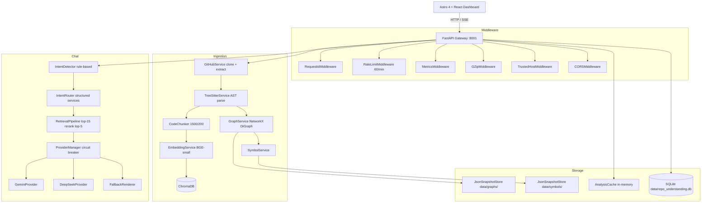
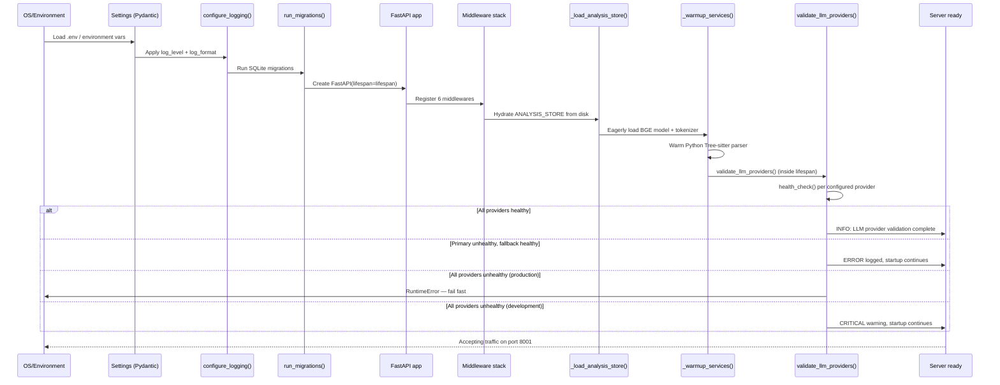
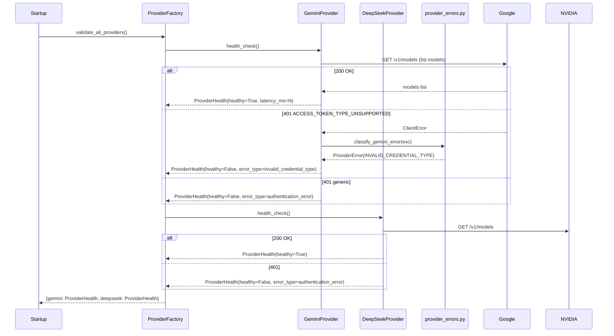
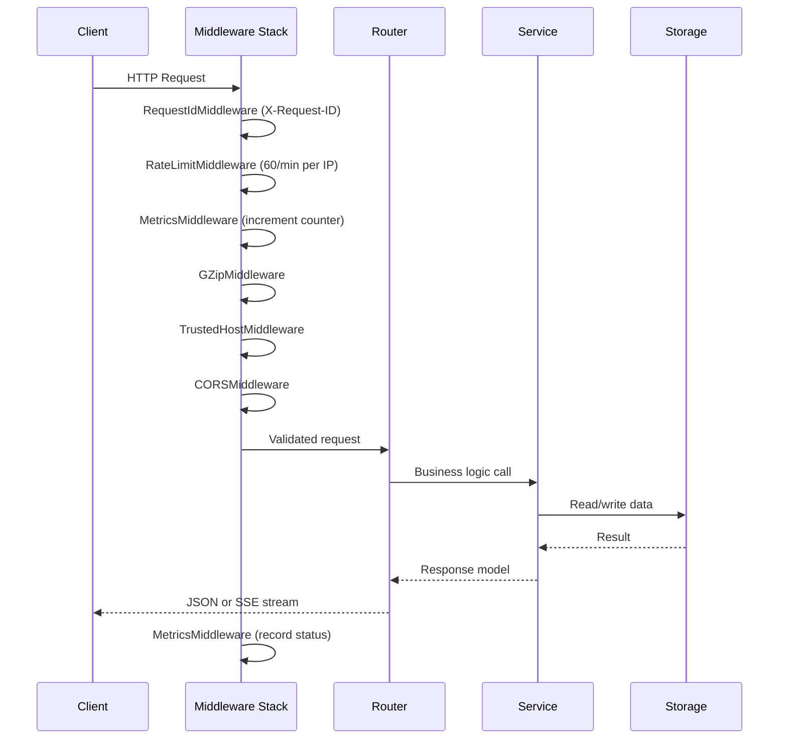
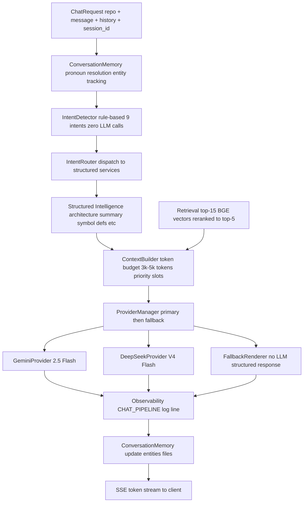
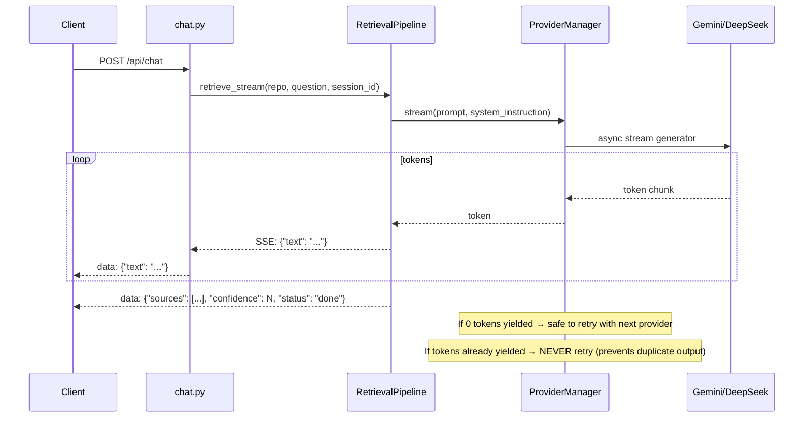
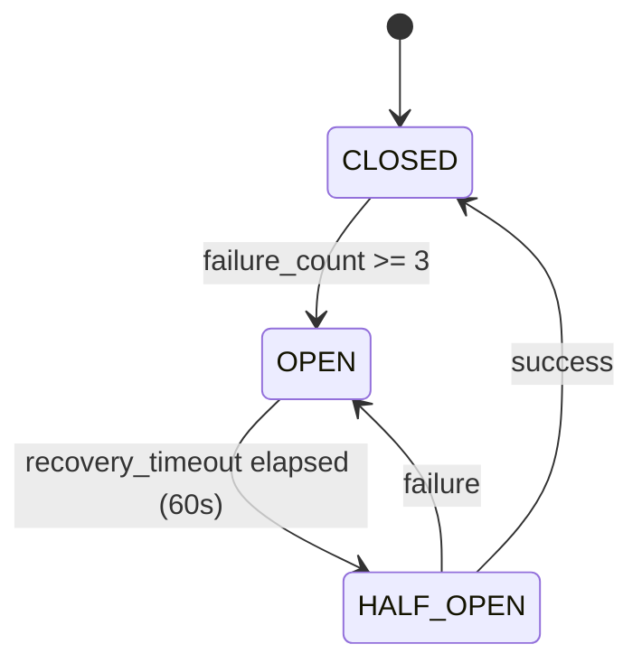
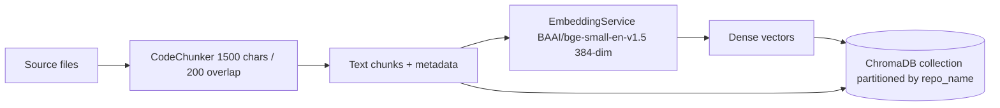
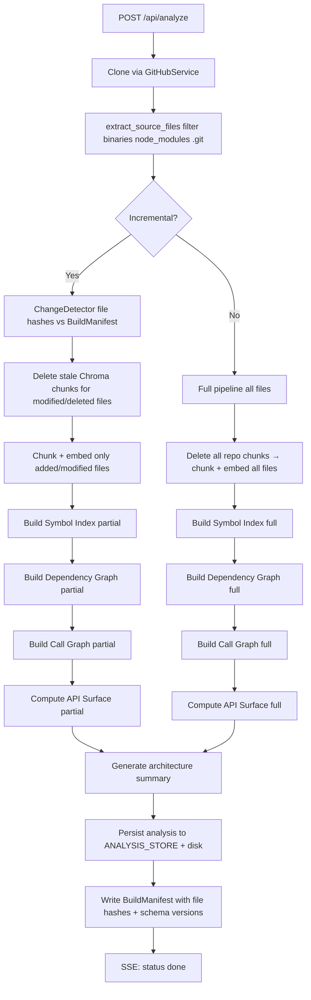
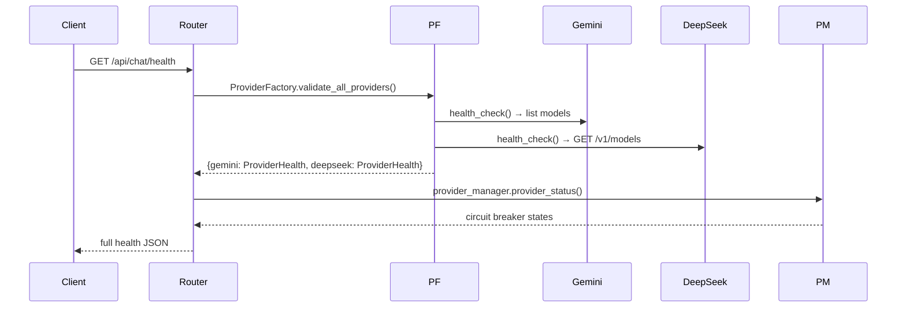

# Architecture Specification

This document describes the production architecture of Repo Intelligence Agent v1.0. Every diagram, component, and flow reflects the current implementation in the codebase.

---

## Table of Contents

1. [High-Level Architecture](#high-level-architecture)
2. [Component Diagram](#component-diagram)
3. [Startup Lifecycle](#startup-lifecycle)
4. [Authentication Flow](#authentication-flow)
5. [Request Lifecycle](#request-lifecycle)
6. [Repository Chat Pipeline (v2)](#repository-chat-pipeline-v2)
7. [Streaming Lifecycle](#streaming-lifecycle)
8. [Retrieval Pipeline](#retrieval-pipeline)
9. [Provider Manager & Failover](#provider-manager--failover)
10. [Embedding Pipeline](#embedding-pipeline)
11. [Repository Analysis Pipeline](#repository-analysis-pipeline)
12. [Incremental Build System](#incremental-build-system)
13. [Tree-sitter Parsing](#tree-sitter-parsing)
14. [Vector Search](#vector-search)
15. [Repository Intelligence](#repository-intelligence)
16. [Health Validation](#health-validation)
17. [Observability & Logging](#observability--logging)
18. [Mathematical Models](#mathematical-models)
19. [API Endpoint Table](#api-endpoint-table)
20. [Skeletal Stubs](#skeletal-stubs)

---

## High-Level Architecture

```
┌────────────────────────────────────────────────────────────┐
│                 Astro 4 + React Dashboard                  │
│  (Chat, React Flow Graphs, Reading Timeline, Reports)      │
└───────────────────────────┬────────────────────────────────┘
                            │ HTTP / SSE
                            ▼
┌────────────────────────────────────────────────────────────┐
│               FastAPI API Gateway  (port 8001)             │
│  RequestId · RateLimit · Metrics · GZip · CORS · Trusted  │
└──────────────┬─────────────────────────────┬───────────────┘
               │                             │
               ▼                             ▼
  ┌─────────────────────┐      ┌───────────────────────────┐
  │  Ingestion Layer    │      │   Chat Pipeline (v2)      │
  │  GitHub Clone       │      │   Conversation Memory     │
  │  Tree-sitter AST    │      │   Intent Detector         │
  │  Code Chunking      │      │   Intent Router           │
  │  BGE Embeddings     │      │   Weighted Retrieval      │
  │  ChromaDB Index     │      │   Context Builder         │
  │  NetworkX Graph     │      │   Provider Manager        │
  └──────────┬──────────┘      │   Fallback Renderer       │
             │                 └────────────┬──────────────┘
             ▼                              │
  ┌──────────────────────────────────────────────────────┐
  │                      Data Layer                      │
  │  ChromaDB (vectors)  ·  NetworkX Graphs (disk)       │
  │  Symbol Index (disk) ·  SQLite (reports, migrations) │
  │  JSON Snapshot Store ·  Analysis Cache (in-memory)   │
  └──────────────────────────────────────────────────────┘
             │
             ▼
  ┌──────────────────────────────────────────────────────┐
  │                 LLM Reasoning Layer                  │
  │  Primary: Gemini 2.5 Flash (google-genai SDK)        │
  │  Fallback: DeepSeek V4 Flash (NVIDIA NIM)            │
  │  Circuit Breaker · Exponential Backoff               │
  │  Startup Health Checks · Error Classification        │
  └──────────────────────────────────────────────────────┘
```

---

## Component Diagram



---

## Startup Lifecycle

The startup sequence in `backend/api.py` follows this order:



---

## Authentication Flow



Error types from `services/llm/provider_errors.py`:
`authentication_error`, `invalid_credential_type`, `missing_credential`, `rate_limit_error`, `quota_exceeded`, `timeout`, `network_error`, `configuration_error`, `unknown_error`

---

## Request Lifecycle



---

## Repository Chat Pipeline (v2)

The chat pipeline is implemented in `services/chat/retrieval_pipeline.py`. The router (`backend/routers/chat.py`) is a thin delegator.



### Intent Types

| Intent | Trigger Keywords | Routes To |
|---|---|---|
| `ARCHITECTURE` | architecture, overview, entry point, structure | `ArchitectureService.get_summary()` |
| `CIRCULAR_DEPENDENCY` | circular, cycle, cyclic, import loop | `ArchitectureService.get_summary()` (cycle data) |
| `API_SURFACE` | api surface, endpoints, routes, exports | `APISurfaceService.load()` |
| `CALL_GRAPH` | who calls, call graph, callers of, called by | `CallGraphService.get_summary()` |
| `SYMBOL` | where is defined, find definition, definition of | `SymbolService.find_definition()` |
| `READING_ORDER` | reading order, onboard, start reading | `ReadingOrderService.get_reading_order()` |
| `IMPACT_ANALYSIS` | blast radius, what breaks, impact, affected files | `ImpactAnalysisService.analyze()` |
| `GENERAL_QA` | how does, what does, explain, describe | Vector search only |
| `UNKNOWN` | (no match) | Vector search only |

---

## Streaming Lifecycle



---

## Retrieval Pipeline

### Tier Weights

| Tier | Weight | File Patterns |
|---|---|---|
| 1 | 1.0 | `backend/`, `services/`, `models/`, `*.py`, `*.ts` |
| 2 | 0.6 | `README.*`, `docs/`, `*.md`, `*.rst` |
| 3 | 0.2 | `requirements.txt`, `pyproject.toml`, `*.toml` |
| 4 | 0.0 | lock files, `node_modules/`, `dist/`, binaries |

### Reranking Score

```
score = (0.5 × similarity + 0.3 × token_overlap) × tier_weight
```

Where `similarity = 1 / (1 + chroma_distance)` and `token_overlap` is normalised query-content keyword overlap.

### BGE Asymmetric Embeddings

Queries are prefixed: `"Represent this sentence for searching relevant passages: "`.
Documents are indexed without any prefix (asymmetric design).

---

## Provider Manager & Failover

`services/chat/provider_manager.py` manages all LLM calls with:

1. **Priority ordering**: Primary provider tried first; secondary as fallback
2. **Circuit breaker**: Opens after 3 failures, retries after 60 s (CLOSED → OPEN → HALF_OPEN → CLOSED)
3. **Streaming safety**: 0 tokens yielded → safe retry; tokens already yielded → never retry (prevents duplicate output in the SSE stream)
4. **Timeout enforcement**: Gemini 30 s per attempt (3 retries); DeepSeek 120 s per attempt (2 retries)



---

## Embedding Pipeline



- Model: `BAAI/bge-small-en-v1.5` via `sentence-transformers`
- Output: 384-dimensional float32 vectors
- Storage: ChromaDB persistent collection, one collection shared across all repos, partitioned via `repo_name` metadata filter
- Warmup: Model is loaded eagerly at startup and warmed with a dummy encode call to avoid first-request latency

---

## Repository Analysis Pipeline



---

## Incremental Build System

The incremental build system (`core/change_detector.py`, `core/build_pipeline.py`) avoids full re-analysis on every run:

1. `ChangeDetector.detect_changes()` hashes every source file and compares against the stored `BuildManifest`
2. Returns a `ChangeSet` with `added`, `modified`, and `deleted` file sets
3. Stale Chroma embeddings for modified/deleted files are bulk-deleted (with fallback to individual deletes)
4. Only added/modified files are re-chunked, re-embedded, and re-indexed
5. Symbol and graph services expose `build_partial()` methods that update only affected nodes and edges
6. A new `BuildManifest` is written atomically after successful completion
7. If schema versions for Symbol Index or Dependency Graph change, a full rebuild is triggered regardless of file changes

---

## Tree-sitter Parsing

`services/tree_sitter_service.py` uses compiled tree-sitter language bindings for:

| Language | Extracts |
|---|---|
| Python | imports, exports, class declarations, functions, methods |
| JavaScript | imports, exports, class declarations, functions |
| TypeScript | imports, exports, class declarations, functions, interfaces |
| JSX / TSX | same as JS/TS with component detection |

Parsers are loaded lazily on first use and warmed at startup (Python only, for latency). The Python Tree-sitter parser is warmed with `ts.parse_file("dummy.py", "def dummy(): pass")` during `_warmup_services()`.

---

## Vector Search

`memory/chroma_store.py` wraps ChromaDB with:

- **Collection**: One persistent collection, partitioned by `repo_name` metadata filter
- **Search**: L2 distance; converted to similarity via `1 / (1 + dist)`
- **Bulk insert**: `add_code_chunks_bulk()` for incremental updates
- **Delete**: `delete_repository()` (full) or metadata-filtered delete (incremental)
- **Chunk metadata**: `repo_name`, `file_path`, `chunk_id`, `language`

---

## Repository Intelligence

The `RepositoryContext` class (`core/repository_context.py`) provides a single lazy-loading interface over all persisted analysis artifacts for a repository:

| Property | Source | Description |
|---|---|---|
| `symbol_index` | `data/symbols/` | Full AST symbol table |
| `dependency_graph` | `data/graphs/` | NetworkX DiGraph |
| `call_graph` | `data/graphs/` | Function-level call graph |
| `git_history` | `data/churn/` | Git churn summary (30-day default) |
| `api_surface` | `data/api_surface/` | Exported symbol classifications |
| `module_stability` | `data/stability/` | Martin's instability metrics |
| `dependency_smells` | `data/dependency_smells/` | Architectural violations |
| `architecture_health` | `data/health/` | Architecture health metrics |

All properties use `AnalysisCache` for in-process caching with schema versioning.

---

## Health Validation

`GET /health` — static configuration report:
```json
{
  "backend": "online",
  "llm_provider": "gemini",
  "llm_model": "gemini-2.5-flash",
  "embedding_provider": "BAAI/bge-small-en-v1.5",
  "vector_db": "chromadb",
  "status": "healthy"
}
```

`GET /api/chat/health` — live provider health diagnostic:
```json
{
  "status": "ok",
  "provider": "gemini",
  "api_key_present": true,
  "authenticated": true,
  "healthy": true,
  "latency_ms": 234.5,
  "error_type": null,
  "error_message": null,
  "recommendation": null,
  "circuit_states": [{"name": "gemini", "circuit_state": "CLOSED", "failure_count": 0}],
  "all_providers": {"gemini": {...}, "deepseek": {...}},
  "timestamp": 1750000000.0
}
```



---

## Observability & Logging

Every chat request emits a `CHAT_PIPELINE` structured log line:

```
CHAT_PIPELINE | repo=owner/repo intent=ARCHITECTURE provider=gemini \
  retrieved=15→5 context_tokens=3842 llm_ms=1240 total_ms=1650 fallback=False
```

And a `CHAT_TRACE` JSON debug log with full stage breakdown (similarity scores, rerank scores, discarded chunks, context slot breakdown, provider circuit state).

Prometheus metrics at `GET /metrics`:

```text
# HELP http_requests_total Total number of HTTP requests.
# TYPE http_requests_total counter
http_requests_total{method="POST",path="/api/chat",status="200"} 42.0

# HELP active_requests_count Total number of active requests.
# TYPE active_requests_count gauge
active_requests_count 1.0

# HELP build_duration_seconds Build pipeline durations in seconds.
# TYPE build_duration_seconds summary
build_duration_seconds_sum{repository="fastapi/fastapi"} 45.123

# HELP cache_hits_total Total number of analysis cache hits.
# TYPE cache_hits_total counter
cache_hits_total{cache_key="symbols"} 12.0
```

---

## Mathematical Models

### Reading Order Composite Score

$$\text{Score}(v) = (100 \cdot \mathbb{I}_{\text{entry}}) + (50 \cdot C_D(v)) + (30 \cdot I_D(v)) + (15 \cdot \mathbb{I}_{\text{core}}) - (40 \cdot \mathbb{I}_{\text{peripheral}})$$

Where $C_D(v)$ is normalized degree centrality, $I_D(v)$ is normalized in-degree, and $\mathbb{I}$ indicators are 0 or 1.

### PR Size Score

$$\text{SizeScore} = \min(N_{\text{files}} \times 3, 30) + \min(N_{\text{symbols}} \times 1.5, 30) + \min(\text{Lines} \times 0.1, 40)$$

Thresholds: XS ≤ 20 · S ≤ 40 · M ≤ 60 · L ≤ 80 · XL > 80

### Blast Radius Depth Promotion

Initial classification by affected file count (LOW/MEDIUM/HIGH/EXTREME), promoted by one tier if propagation depth $\geq 3$.

### Repository Health Score

$$S_{repo} = 0.25 S_{arch} + 0.20 S_{api} + 0.20 S_{hygiene} + 0.20 S_{churn} + 0.15 S_{read}$$

See [docs/repository_intelligence_report_rfc.md](docs/repository_intelligence_report_rfc.md) for full sub-score formulas.

---

## API Endpoint Table

Base URL: `http://localhost:8001` — all routes also available under `/api/v1/` prefix.

| Method | Path | Description |
|---|---|---|
| `GET` | `/health` | Static health check |
| `GET` | `/metrics` | Prometheus metrics |
| `GET` | `/api/repos/examples` | Pre-configured example repos |
| `GET` | `/api/repos/recent` | Recently analyzed repos |
| `POST` | `/api/index` | Vector-only indexing |
| `POST` | `/api/analyze` | Full analysis pipeline (SSE) |
| `GET` | `/api/analysis/{owner}/{repo}` | Fetch analysis result |
| `POST` | `/api/repos/repair` | Rebuild missing indexes |
| `POST` | `/api/retrieve` | Vector search + LLM answer |
| `POST` | `/api/chat` | Streaming chat (SSE) |
| `GET` | `/api/chat/health` | Live provider health diagnostic |
| `POST` | `/api/chat/reload` | Hot-reload LLM provider |
| `POST` | `/api/issues/map` | GitHub issue → implementation plan |
| `POST` | `/api/architecture/build` | Build dependency graph |
| `GET` | `/api/architecture/{owner}/{repo}` | Architecture summary |
| `GET` | `/api/architecture/{owner}/{repo}/graph` | React Flow graph |
| `POST` | `/api/reading-order` | Onboarding reading order |
| `POST` | `/api/impact-analysis` | Change impact prediction |
| `GET` | `/api/graph/{owner}/{repo}/full` | Full interactive graph |
| `GET` | `/api/graph/{owner}/{repo}/neighbors/{path}` | Node neighborhood |
| `GET` | `/api/graph/{owner}/{repo}/trace/{path}` | BFS trace |
| `GET` | `/api/graph/{owner}/{repo}/search` | Node search |
| `GET` | `/api/symbols/{owner}/{repo}/file/{path}` | File symbols |
| `GET` | `/api/symbols/{owner}/{repo}/definition/{name}` | Symbol definition |
| `GET` | `/api/symbols/{owner}/{repo}/references/{name}` | Symbol references |
| `POST` | `/api/call-graph/build` | Build call graph (SSE) |
| `GET` | `/api/call-graph/{owner}/{repo}` | React Flow call graph |
| `GET` | `/api/call-graph/{owner}/{repo}/stats` | Call graph statistics |
| `GET` | `/api/call-graph/{owner}/{repo}/callers/{fn}` | Callers of a function |
| `GET` | `/api/call-graph/{owner}/{repo}/callees/{fn}` | Callees of a function |
| `GET` | `/api/call-graph/{owner}/{repo}/hierarchy/{fn}` | Call hierarchy tree |
| `GET` | `/api/call-graph/{owner}/{repo}/blast-radius/{fn}` | Function blast radius |
| `GET` | `/api/call-graph/{owner}/{repo}/neighbors/{fn}` | Call graph neighbors |
| `GET` | `/api/call-graph/{owner}/{repo}/trace/{fn}` | Call graph BFS trace |
| `POST` | `/api/api-surface/build` | Build API surface (SSE) |
| `GET` | `/api/api-surface/{owner}/{repo}` | Full API surface report |
| `GET` | `/api/api-surface/{owner}/{repo}/stats` | API surface statistics |
| `GET` | `/api/api-surface/{owner}/{repo}/public` | Public symbols |
| `GET` | `/api/api-surface/{owner}/{repo}/internal` | Internal symbols |
| `GET` | `/api/api-surface/{owner}/{repo}/deprecated` | Deprecated symbols |
| `GET` | `/api/api-surface/{owner}/{repo}/breaking` | Breaking changes |
| `GET` | `/api/api-surface/{owner}/{repo}/{symbol}` | Single symbol details |
| `POST` | `/api/churn/analyze` | Mine git history (SSE) |
| `GET` | `/api/churn/{owner}/{repo}` | Churn summary |
| `GET` | `/api/churn/{owner}/{repo}/hotspots` | Top hotspot files |
| `GET` | `/api/churn/{owner}/{repo}/file/{path}` | Single file churn |
| `GET` | `/api/churn/{owner}/{repo}/timeline` | Weekly activity timeline |
| `POST` | `/api/pr/analyze` | PR risk and blast radius |
| `GET` | `/api/pr/health` | PR intelligence diagnostics |
| `POST` | `/api/architecture/drift` | Architecture drift detection |
| `POST` | `/api/dead-code/analyze` | Dead code sweep |
| `POST` | `/api/v1/report/{owner}/{repo}/build` | Build intelligence report |
| `GET` | `/api/v1/report/{owner}/{repo}/summary` | Report health summary |
| `GET` | `/api/v1/report/{owner}/{repo}/download` | Download HTML/PDF/Markdown |

---

## Skeletal Stubs

Two architectural stubs exist in the codebase. Their routers are registered but contain no endpoints:

| Module | Status | MVP Handling |
|---|---|---|
| `backend/routers/stability.py` | Placeholder — no endpoints | `RepositoryContext.module_stability` loads persisted data but no router yet |
| `backend/routers/dependency_smells.py` | Placeholder — no endpoints | `RepositoryContext.dependency_smells` loads persisted data but no router yet |

Two agent stubs exist that raise `NotImplementedError`:

| Module | Status | Current Handling |
|---|---|---|
| `agents/analyzer.py` — `RepositoryAnalyzer` | Stub | Ingestion logic inlined in `backend/routers/repositories.py` |
| `agents/explainer.py` — `ArchitectureExplainer` | Stub | Reading order handled by `services/reading_order_service.py` |

Two agents are fully functional:

| Module | Status |
|---|---|
| `agents/issue_mapper.py` — `IssueMapper` | Production, 2-LLM-call pipeline |
| `agents/evaluator.py` — `EvaluationAgent` | Production, citation verification |
