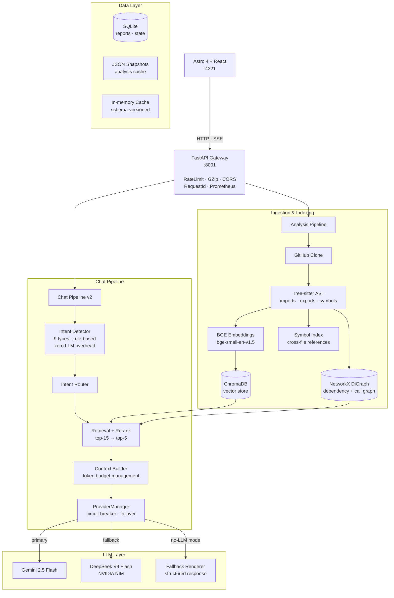

<div align="center">

<br/>

# 🧠 Repo Intelligence Agent

### Structural codebase intelligence — not just vector search.

<p>
Most AI dev tools are text retrievers wearing a code costume.<br/>
This one builds a real dependency graph, call graph, and symbol index — <em>then</em> answers your questions.
</p>

<br/>

<!-- Status -->
[](https://github.com/VarshithReddy2006/Repo-Intelligence-Agent/actions)


<!-- Stack -->
<br/>


<br/>

[**Quick Start**](#️-quick-start) · [**Capabilities**](#-capabilities) · [**Architecture**](#️-architecture) · [**API Reference**](#-api-reference) · [**Performance**](#-performance) · [**Roadmap**](#️-roadmap)

<br/>

</div>

---

## 🖼️ Preview

> [!NOTE]
> Screenshots and a live demo GIF are coming soon. ⭐ **[Star the repo](https://github.com/VarshithReddy2006/Repo-Intelligence-Agent)** to be notified when they drop.

<div align="center">

| 📊 Codebase Dashboard | 🌐 Interactive Dependency Graph |
|:---:|:---:|
| *Add screenshot to `docs/assets/dashboard.png`* | *Add screenshot to `docs/assets/graph.png`* |

| 💬 Streaming Repository Chat | 📈 Intelligence Report |
|:---:|:---:|
| *Add screenshot to `docs/assets/chat.png`* | *Add screenshot to `docs/assets/report.png`* |

</div>

> 💡 Add screenshots to `docs/assets/` to populate the preview gallery above.

---

## 🔴 The Problem

Most codebase AI assistants run the same playbook: split source files into chunks, embed them, and retrieve by similarity. For prose, that works well. For code, **it is structurally blind.**

Code is not a collection of text fragments. It is a directed graph of modules, symbols, and call sites. What matters — and what vector similarity cannot surface — is:

| Structural Dimension | What's Missing |
|---|---|
| 📦 **Import topology** | Which modules depend on which, and in what direction |
| 🔗 **Call hierarchies** | What a function transitively invokes across files |
| 🎯 **Reachability** | Which files are actually reached from any entry point |
| 💥 **Coupling** | Which files will be affected by a given change |

```
Traditional RAG pipeline:

  Repository  →  chunk  →  embed  →  similarity search  →  LLM  →  answer
                                             ↑
                              ┌──────────────────────────┐
                              │   no import graph        │
                              │   no call graph          │
                              │   no symbol index        │
                              │   no reachability        │
                              │   no change impact       │
                              └──────────────────────────┘
```

> [!CAUTION]
> The result: hallucinated import paths, missed transitive side effects, and zero blast-radius awareness. **Semantic similarity is not a substitute for structural knowledge.**

---

## ✅ The Solution

Repo Intelligence Agent runs a **structural analysis pass before any retrieval**. The dependency graph, call graph, and symbol index are built first — from the AST. Retrieval is grounded in that structure, not in raw text similarity.

```
Repository
 ├── Tree-sitter AST ──────────→  imports · exports · symbols · call sites
 │                                               │
 │                                    NetworkX DiGraph
 │                                     ├── BFS reachability traces
 │                                     ├── centrality-ordered reading
 │                                     ├── blast-radius estimation
 │                                     └── architecture drift delta
 │
 ├── BGE-small-en-v1.5 ────────→  ChromaDB (semantic search)
 └── Git history mining ───────→  churn scores · hotspot files
                                               │
                               Gemini 2.5 Flash / DeepSeek V4 Flash
                                               │
                                   Structurally grounded answers
```

> [!IMPORTANT]
> Every LLM call receives retrieved chunks **plus** the structural context that makes those chunks meaningful: which modules import the file, which functions call the symbol, and which other files would be affected by a change.

---

## ⚡ How We Compare

Traditional RAG tools index text. This tool indexes **your codebase's structure.**

| Capability | Traditional RAG | Repo Intelligence Agent |
|---|:---:|:---:|
| 🔍 Semantic code search | ✅ | ✅ |
| 📦 Dependency graph (import topology) | ❌ | ✅ |
| 🔗 Call graph (function-level) | ❌ | ✅ |
| 🏷️ AST symbol index | ❌ | ✅ |
| 🎯 Reachability traces (BFS) | ❌ | ✅ |
| 💀 Dead code detection | ❌ | ✅ |
| 🏗️ Architecture drift detection | ❌ | ✅ |
| 💥 PR blast-radius scoring | ❌ | ✅ |
| 🔥 Churn × coupling hotspot analysis | ❌ | ✅ |
| 🔌 API surface with stability coefficients | ❌ | ✅ |
| ⚡ Incremental analysis (hash-based) | ❌ | ✅ |
| 📚 Onboarding reading order | ❌ | ✅ |
| 🐛 Issue → implementation plan mapping | ❌ | ✅ |
| 📊 Intelligence Report (HTML / PDF / MD) | ❌ | ✅ |
| 🧠 Rule-based intent routing (zero LLM overhead) | ❌ | ✅ |
| 🔄 Circuit-breaker LLM failover | ❌ | ✅ |
| 📈 Prometheus observability | ❌ | ✅ |

---

## 🚀 Capabilities

<details open>
<summary><strong>🔬 Repository Analysis</strong></summary>

<br/>

**Full structural pipeline** — Clone any public GitHub repository and run AST parsing, embedding, graph construction, and analysis in one command. Pipeline stages run as a DAG — tasks are parallelized where dependencies allow.

**Incremental rebuilds** — Changed files are detected by content hash. On subsequent runs, only modified files are re-parsed, re-embedded, and re-indexed. Small change sets rebuild in **under 2 seconds.**

**Tech stack detection** — Automatically identifies languages, frameworks, and build tooling from file extensions and configuration files before analysis begins.

</details>

<details open>
<summary><strong>🧠 Code Intelligence</strong></summary>

<br/>

| Feature | What It Does |
|---|---|
| **Symbol Index** | AST-extracted index of every class, function, and method across the repository. Definition lookup and cross-file reference search — no language server required. |
| **Dead Code Detection** | Reachability sweep from detected entry points across the full dependency graph. Identifies unused files, orphaned modules, and dead dependency chains. Each finding carries a **cleanup score (0–100)** to prioritize remediation. |
| **API Surface Intelligence** | Classifies every exported symbol as `public`, `internal`, or `deprecated`. Computes Martin's instability coefficients per module. Detects breaking changes between repository versions. |
| **Churn Analysis** | Mines git commit history to produce per-file churn scores. Identifies **hotspot files** — those with high churn combined with high coupling — with weekly activity timelines. |

</details>

<details open>
<summary><strong>🌐 Graph Intelligence</strong></summary>

<br/>

**Architecture Graph** — Interactive React Flow dependency graph with search filtering, node neighborhood inspection, and forward/backward BFS reachability traces. Visualizes the complete import topology of the repository.

**Call Graph** — Function-level call graph built from AST analysis. Supports callers, callees, hierarchy walks, and blast-radius estimation per function — useful for understanding the reach of any proposed change.

</details>

<details open>
<summary><strong>💬 Developer Workflows</strong></summary>

<br/>

| Workflow | What It Does |
|---|---|
| **Repository Chat** | Streaming chat over any indexed repository via Server-Sent Events. Nine intent types are detected by a rule-based classifier — **no LLM call is made for routing.** Each response includes source citations and a confidence score. |
| **PR Intelligence** | Risk-scores pull requests by size (XS → XL) and blast radius (LOW → EXTREME). Detects architectural drift by delta-patching the dependency graph against the PR's changed files. |
| **Issue Mapper** | Maps GitHub issues to source files using embedding retrieval and two targeted LLM calls — one to rank candidate files, one to generate an implementation plan. Results are cached to avoid redundant API calls. |

</details>

<details open>
<summary><strong>📊 Intelligence Report — The Flagship Output</strong></summary>

<br/>

Aggregates every analysis dimension into a unified health report scored across five axes:

| Dimension | What Is Measured |
|---|---|
| 🏗️ **Architecture Stability** | Module coupling · circular dependency depth · instability coefficients |
| 🔌 **API Quality** | Public / internal / deprecated symbol ratios · breaking change count |
| 🧹 **Code Hygiene** | Dead code ratio · orphaned module count |
| 🔥 **Hotspot Risk** | Churn × coupling composite score per file |
| 📚 **Onboarding Clarity** | Reading-order quality · entry-point coverage |

**Export formats:** Interactive HTML · Print-optimized PDF · Collapsible Markdown *(suitable for GitHub PR comments)*

</details>

---

## 🏗️ Architecture



> 🗂️ Full component diagrams, sequence diagrams, and mathematical models are documented in [ARCHITECTURE.md](ARCHITECTURE.md).

---

## ⚙️ How It Works

Each repository analysis runs through **eight sequential stages.** Incremental mode re-runs only stages 2–6 for files that have changed since the last run.

<details>
<summary><strong>View the 8-stage analysis pipeline</strong></summary>

<br/>

| Stage | Name | Input → Output | Why It Matters |
|:---:|---|---|---|
| **1** | **Clone** | GitHub URL → local working copy | Provides the file tree and git history for all downstream stages |
| **2** | **Parse** | Source files → AST nodes | Extracts structural information that text chunking cannot recover |
| **3** | **Embed** | Code chunks → BGE-small-en-v1.5 vectors | Enables semantic search over code semantics |
| **4** | **Index** | Vectors + metadata → ChromaDB | Persists embeddings for retrieval without re-encoding on each query |
| **5** | **Graph** | AST import/call nodes → NetworkX DiGraph | Enables reachability traces, centrality ranking, and blast-radius estimation |
| **6** | **Analyze** | Graph + git history → scores + findings | Produces the structural intelligence that grounds LLM responses |
| **7** | **Reason** | Query + chunks + structural context → answer | LLM operates on structurally filtered context, not raw similarity results |
| **8** | **Deliver** | All outputs → Dashboard · Chat · Report · REST API | Multiple consumption surfaces for different developer workflows |

</details>

> [!TIP]
> **Why incremental is fast:** Subsequent runs skip re-embedding and re-indexing for unchanged files. Only files whose content hash has changed are re-processed through the pipeline. Graph nodes for unchanged files are read from the schema-versioned in-memory cache rather than recomputed.

---

## 🛠️ Technology Stack

| Layer | Technology | Purpose |
|---|---|---|
| Frontend | Astro 4 + React | Dashboard, chat UI, report viewer |
| Graph UI | React Flow | Architecture and call graph visualization |
| Backend | FastAPI | Async API gateway, middleware stack, Server-Sent Events |
| AST Parsing | Tree-sitter | Language-agnostic symbol and import extraction |
| Embeddings | BAAI/bge-small-en-v1.5 | Code chunk encoding — runs locally, **no API cost** |
| Vector Store | ChromaDB | Local vector search and retrieval with persistence |
| Graph Engine | NetworkX | Dependency graph, BFS traversal, centrality |
| Primary LLM | Gemini 2.5 Flash | Reasoning and generation |
| Fallback LLM | DeepSeek V4 Flash (NVIDIA NIM) | Circuit-breaker secondary provider |
| Persistence | SQLite + JSON snapshots | Reports, analysis state |
| Metrics | Prometheus | HTTP and build pipeline observability |
| Testing | pytest | 535 tests — isolated from LLM and GitHub APIs |

<details>
<summary><strong>View directory layout</strong></summary>

```
Repo-Intelligence-Agent/
├── backend/
│   ├── api.py                     # App factory, middleware stack, router registration
│   ├── main.py                    # Uvicorn entry point with watch-dir filtering
│   ├── settings.py                # Pydantic Settings — all configuration via env vars
│   ├── dependencies.py            # Service singletons and analysis store
│   ├── security_middleware.py     # Sliding-window rate limiter (per IP)
│   ├── metrics_middleware.py      # Prometheus HTTP metrics
│   └── routers/                   # One router module per feature domain
│
├── services/
│   ├── chat/                      # Chat v2 pipeline
│   │   ├── retrieval_pipeline.py  # Authoritative pipeline entry point
│   │   ├── intent_detector.py     # Rule-based classifier, 9 intent types
│   │   ├── intent_router.py       # Routes intents to structured services
│   │   ├── conversation_memory.py # Session memory and pronoun resolution
│   │   ├── retrieval.py           # Tier-weighted chunk reranking
│   │   ├── context_builder.py     # Token budget management
│   │   ├── provider_manager.py    # Circuit breaker and provider failover
│   │   └── fallback_renderer.py   # Structured response without LLM
│   ├── llm/
│   │   ├── gemini_provider.py     # Gemini 2.5 Flash integration
│   │   ├── deepseek_provider.py   # DeepSeek V4 Flash via NVIDIA NIM
│   │   └── provider_factory.py    # Singleton, hot-reload, startup validation
│   ├── report/
│   │   ├── composer.py            # Assembles ReportDataModel from all services
│   │   └── renderer.py            # HTML, Markdown, and PDF renderers
│   └── *.py                       # Architecture, graph, symbol, PR, drift, churn services
│
├── agents/                        # IssueMapper, EvaluationAgent
├── core/
│   ├── cache.py                   # Schema-versioned in-memory cache
│   ├── change_detector.py         # File hash-based incremental detection
│   ├── analysis_registry.py       # DAG task registry
│   └── build_pipeline.py          # DAG orchestration
├── memory/                        # ChromaStore adapter
├── models/                        # Pydantic domain models
├── storage/                       # JsonSnapshotStore, SQLite migrations
├── frontend/                      # Astro 4 + React dashboard
├── tests/                         # 535 passing tests, no API quota required
└── docs/                          # Extended documentation
```

</details>

---

## ⚡ Quick Start

### Prerequisites

| Requirement | Version / Notes |
|---|---|
| Python | 3.10, 3.11, or 3.12 |
| Node.js | ≥ 18 |
| Git | Any recent version |
| LLM API key | Google Gemini **or** NVIDIA NIM |
| Disk space | ~2 GB (BGE model cache on first run) |

### 1 — Backend

```bash
git clone https://github.com/VarshithReddy2006/Repo-Intelligence-Agent.git
cd Repo-Intelligence-Agent

python -m venv .venv
source .venv/bin/activate        # Windows: .venv\Scripts\activate

pip install -e .

cp .env.example .env
# Open .env and set GEMINI_API_KEY or DEEPSEEK_API_KEY

python backend/main.py           # API starts at http://localhost:8001
```

### 2 — Frontend

```bash
cd frontend
npm install
npm run dev                      # Dashboard at http://localhost:4321
```

### 3 — Docker *(recommended for production)*

```bash
# Production
docker compose -f docker-compose.prod.yml up -d --build

# Development with hot reload
docker compose -f docker-compose.dev.yml up -d --build
```

> [!NOTE]
> Named volumes mount `data/` (ChromaDB, graphs, SQLite) and the cloned repository cache independently of the container lifecycle. Data persists across container restarts.

### 4 — Verify

```bash
curl http://localhost:8001/health
```

```json
{
  "backend": "online",
  "llm_provider": "gemini",
  "llm_model": "gemini-2.5-flash",
  "embedding_provider": "BAAI/bge-small-en-v1.5",
  "vector_db": "chromadb",
  "status": "healthy"
}
```

---

## 🎯 Usage

### Analyze a Repository

```bash
# CLI
repo-intel analyze https://github.com/fastapi/fastapi

# API — streams SSE progress events, one per pipeline stage
curl -N -X POST http://localhost:8001/api/analyze \
  -H "Content-Type: application/json" \
  -d '{"url": "https://github.com/fastapi/fastapi", "branch": "master"}'
```

### Chat with a Repository

```bash
curl -N -X POST http://localhost:8001/api/chat \
  -H "Content-Type: application/json" \
  -d '{
    "repo": "fastapi/fastapi",
    "message": "How is dependency injection implemented?",
    "history": []
  }'
```

> [!NOTE]
> Responses stream as `text/event-stream`. Each SSE event carries a token delta. The final event carries `"status": "done"` along with a `sources` array and a `confidence` score.

```bash
curl http://localhost:8001/api/chat/health    # Check active provider and circuit breaker state
curl -X POST http://localhost:8001/api/chat/reload  # Hot-reload provider config — no restart required
```

### Generate an Intelligence Report

```bash
# CLI
repo-intel report fastapi/fastapi
repo-intel report fastapi/fastapi --markdown
repo-intel report fastapi/fastapi --pdf -o report.html

# API
curl -X POST http://localhost:8001/api/v1/report/fastapi/fastapi/build
curl -o report.html "http://localhost:8001/api/v1/report/fastapi/fastapi/download?format=html"
curl -o report.md   "http://localhost:8001/api/v1/report/fastapi/fastapi/download?format=markdown"
```

### PR Risk Analysis

```bash
curl -X POST http://localhost:8001/api/pr/analyze \
  -H "Content-Type: application/json" \
  -d '{"owner": "fastapi", "repo": "fastapi", "pr_number": 1234}'
```

Returns size classification (XS → XL), blast radius (LOW → EXTREME), symbol diffs, and an architecture drift report.

### Dead Code Detection

```bash
curl -X POST http://localhost:8001/api/dead-code/analyze \
  -H "Content-Type: application/json" \
  -d '{"owner": "fastapi", "repo": "fastapi"}'
```

### Issue Mapping

```bash
curl -X POST http://localhost:8001/api/issues/map \
  -H "Content-Type: application/json" \
  -d '{"owner": "fastapi", "repo": "fastapi", "issue_number": 42}'
```

---

## 🔧 Configuration

```bash
cp .env.example .env
```

### Required

| Variable | Default | Description |
|---|---|---|
| `LLM_PROVIDER` | `gemini` | Active provider: `gemini` or `deepseek` |
| `GEMINI_API_KEY` | — | Google AI Studio key — required when `LLM_PROVIDER=gemini` |
| `DEEPSEEK_API_KEY` | — | NVIDIA NIM key — required when `LLM_PROVIDER=deepseek` |

### Optional

<details>
<summary><strong>View all optional environment variables</strong></summary>

<br/>

| Variable | Default | Description |
|---|---|---|
| `GEMINI_MODEL` | `gemini-2.5-flash` | Gemini model variant |
| `DEEPSEEK_BASE_URL` | `https://integrate.api.nvidia.com/v1` | NIM API endpoint |
| `DEEPSEEK_MODEL` | `deepseek-ai/deepseek-v4-flash` | DeepSeek model variant |
| `GITHUB_TOKEN` | — | PAT for private repositories or higher rate limits |
| `API_SERVER_HOST` | `0.0.0.0` | Uvicorn bind host |
| `API_SERVER_PORT` | `8001` | Uvicorn bind port |
| `FRONTEND_URL` | `http://localhost:4321` | Allowed CORS origin — **set to your production domain before deploying** |
| `SQLITE_DB_PATH` | `data/repo_understanding.db` | SQLite database path |
| `CHROMA_DB_PATH` | `data/chroma_db` | ChromaDB persistence directory |
| `CLONED_REPOS_PATH` | `~/.repo_intelligence/cloned_repos` | Clone destination — must be **outside** the project tree to avoid triggering uvicorn reload loops |
| `APP_ENV` | `development` | `development` or `production` — controls fail-fast behavior at startup |
| `LOG_LEVEL` | `INFO` | Logging verbosity |
| `LOG_FORMAT` | `human` | `human` or `json` — use `json` in production |
| `RATE_LIMIT_PER_MINUTE` | `60` | Max requests per IP per minute |
| `ALLOWED_HOSTS` | `["*"]` | TrustedHost middleware allowed hostnames |

</details>

> [!IMPORTANT]
> **Production checklist:** Set `FRONTEND_URL` to your domain, `APP_ENV=production`, and `LOG_FORMAT=json`. In production mode, invalid LLM credentials fail fast at startup with an actionable error message rather than silently degrading at request time.

---

## 📡 API Reference

Base URL: `http://localhost:8001` · All routes also available under `/api/v1/`

<details>
<summary><strong>Core &amp; Repository</strong></summary>

<br/>

| Method | Path | Description |
|---|---|---|
| `GET` | `/health` | System health and active LLM provider |
| `GET` | `/metrics` | Prometheus metrics |
| `POST` | `/api/analyze` | Full analysis pipeline (SSE) |
| `POST` | `/api/index` | Vector-only indexing |
| `GET` | `/api/analysis/{owner}/{repo}` | Fetch analysis result |
| `POST` | `/api/repos/repair` | Rebuild missing symbol or graph indexes |
| `GET` | `/api/repos/recent` | Recently analyzed repositories |
| `GET` | `/api/repos/examples` | Pre-configured example repositories |

</details>

<details>
<summary><strong>Chat</strong></summary>

<br/>

| Method | Path | Description |
|---|---|---|
| `POST` | `/api/chat` | Streaming repository chat (SSE) |
| `POST` | `/api/retrieve` | Vector search with LLM-generated answer |
| `GET` | `/api/chat/health` | Live provider health diagnostic |
| `POST` | `/api/chat/reload` | Hot-reload LLM provider configuration |

</details>

<details>
<summary><strong>Graphs — Dependency &amp; Call</strong></summary>

<br/>

| Method | Path | Description |
|---|---|---|
| `POST` | `/api/architecture/build` | Build dependency graph |
| `GET` | `/api/architecture/{owner}/{repo}/graph` | React Flow graph payload |
| `GET` | `/api/graph/{owner}/{repo}/neighbors/{path}` | Node neighborhood |
| `GET` | `/api/graph/{owner}/{repo}/trace/{path}` | BFS reachability trace |
| `GET` | `/api/graph/{owner}/{repo}/search` | Graph node search |
| `POST` | `/api/call-graph/build` | Build call graph (SSE) |
| `GET` | `/api/call-graph/{owner}/{repo}` | React Flow call graph payload |
| `GET` | `/api/call-graph/{owner}/{repo}/callers/{fn}` | Callers of a function |
| `GET` | `/api/call-graph/{owner}/{repo}/callees/{fn}` | Callees of a function |
| `GET` | `/api/call-graph/{owner}/{repo}/blast-radius/{fn}` | Function blast radius |

</details>

<details>
<summary><strong>Analysis — Symbols, API Surface, Churn, PR</strong></summary>

<br/>

| Method | Path | Description |
|---|---|---|
| `GET` | `/api/symbols/{owner}/{repo}/file/{path}` | Symbols in a file |
| `GET` | `/api/symbols/{owner}/{repo}/definition/{name}` | Symbol definition lookup |
| `GET` | `/api/symbols/{owner}/{repo}/references/{name}` | Symbol cross-references |
| `POST` | `/api/api-surface/build` | Build API surface index (SSE) |
| `GET` | `/api/api-surface/{owner}/{repo}` | Full API surface report |
| `GET` | `/api/api-surface/{owner}/{repo}/public` | Public symbols only |
| `GET` | `/api/api-surface/{owner}/{repo}/breaking` | Breaking change detection |
| `POST` | `/api/churn/analyze` | Mine git history for churn scores (SSE) |
| `GET` | `/api/churn/{owner}/{repo}/hotspots` | Top hotspot files |
| `POST` | `/api/pr/analyze` | PR risk scoring and blast radius |
| `POST` | `/api/architecture/drift` | Architecture drift detection |
| `POST` | `/api/dead-code/analyze` | Dead code reachability sweep |
| `POST` | `/api/issues/map` | Map GitHub issue to implementation plan |
| `POST` | `/api/reading-order` | Onboarding-optimized reading order |
| `POST` | `/api/impact-analysis` | Change impact prediction |

</details>

<details>
<summary><strong>Reports</strong></summary>

<br/>

| Method | Path | Description |
|---|---|---|
| `POST` | `/api/v1/report/{owner}/{repo}/build` | Build intelligence report |
| `GET` | `/api/v1/report/{owner}/{repo}/summary` | Health summary |
| `GET` | `/api/v1/report/{owner}/{repo}/download` | Download HTML · PDF · Markdown |

</details>

> 📄 Full request/response schemas are documented in [docs/API_REFERENCE.md](docs/API_REFERENCE.md).

---

## 📈 Performance

Measured on development hardware. Repository size, file count, and I/O characteristics will affect results.

| Operation | Duration |
|---|---|
| Fresh analysis — small repository (~300 files) | 25–45 s |
| **Incremental rebuild (small change set)** | **< 2 s** |
| Architecture graph build | ~1.8 s |
| PR risk analysis | ~1.5 s |
| Chat — first token latency | < 3 s |
| Chat — streaming throughput | ~50–90 ms / token |

> [!TIP]
> **Why incremental is fast:** Subsequent runs skip re-embedding and re-indexing for unchanged files. Only files whose content hash has changed are re-processed. Graph nodes for unchanged files are served from the schema-versioned in-memory cache — not recomputed.

### Prometheus Metrics

Exposed at `/metrics`:

| Metric | Type | Description |
|---|---|---|
| `http_requests_total` | Counter | Requests by method, path, and status |
| `active_requests_count` | Gauge | In-flight requests |
| `build_duration_seconds` | Histogram | Per-repository build durations |
| `analysis_task_duration_seconds` | Histogram | Per-task durations |
| `cache_hits_total` | Counter | Cache hit count |
| `cache_misses_total` | Counter | Cache miss count |

---

## 🛡️ Production Readiness

Built to be operated, not just installed.

| Concern | Implementation |
|---|---|
| **Observability** | Prometheus metrics at `/metrics` with histograms for build and task durations |
| **Structured logging** | JSON log format via `LOG_FORMAT=json`, with request IDs on every log line |
| **Health endpoint** | `/health` reports backend status, active LLM provider, and vector store state |
| **Rate limiting** | Sliding-window per-IP limiter — configurable via `RATE_LIMIT_PER_MINUTE` |
| **CORS** | Restricted to `FRONTEND_URL` — set to your production domain before deploying |
| **Input validation** | Pydantic model validation on every request body |
| **Secret handling** | API keys loaded from environment variables only — never logged or exposed |
| **LLM circuit breaker** | ProviderManager tracks LLM health and fails over to DeepSeek on provider errors |
| **Fallback renderer** | If both LLM providers are unavailable, structured responses render without LLM |
| **Fail-fast startup** | In `APP_ENV=production`, misconfiguration halts startup with an actionable error |
| **Incremental analysis** | Hash-based change detection prevents redundant work on re-runs |
| **In-memory cache** | Schema-versioned cache prevents stale data from surviving configuration changes |
| **Docker** | Production and development Compose files with named volumes for data persistence |
| **TrustedHost** | `ALLOWED_HOSTS` middleware for hostname validation |

> [!WARNING]
> **No built-in authentication.** Multi-tenant or public deployments must add a reverse proxy with authentication in front of the backend.

---

## 🧪 Testing

```bash
pytest tests/ -v                                      # Full suite
pytest tests/ --cov=. --cov-report=term-missing      # With coverage
```

- **535 tests** across unit, integration, and service-layer categories
- LLM and GitHub API boundaries are **isolated with mock adapters** — the full suite runs without consuming any API quota
- GitHub Actions runs the full test suite, lint check, and format check on every pull request

> [!CAUTION]
> Always run `pytest tests/` with the explicit path. Running bare `pytest` from the repository root will traverse `data/` and encounter import errors from cloned repositories.

---

## 🗺️ Roadmap

### v1.0.0 — ✅ Shipped

- [x] Full structural analysis pipeline with incremental hash-based rebuilds
- [x] Repository Chat v2 with 9 classified intent types and rule-based routing
- [x] Architecture graph and call graph with React Flow visualization
- [x] PR risk scoring and architecture drift detection
- [x] Dead code detection with weighted cleanup scores
- [x] Intelligence Report in HTML, PDF, and Markdown

### v1.1 — Planned

- [ ] Multi-language AST support (beyond Python)
- [ ] Private repository support via GitHub App
- [ ] Persistent cross-session conversation memory
- [ ] Webhook-triggered incremental analysis on push events
- [ ] Comparative Intelligence Reports across repository versions

### Under Consideration

- [ ] Graph diff visualization between commits
- [ ] Team-scoped deployments with per-user history
- [ ] Custom scoring weights for report dimensions

---

## 🤝 Contributing

Contributions are welcome. This project follows the [Contributor Covenant](CODE_OF_CONDUCT.md). See [CONTRIBUTING.md](CONTRIBUTING.md) for the development workflow, coding standards, and pull request guidelines.

Good first issues are tagged [`good-first-issue`](https://github.com/VarshithReddy2006/Repo-Intelligence-Agent/issues?q=label%3Agood-first-issue). Questions and ideas welcome in [Discussions](https://github.com/VarshithReddy2006/Repo-Intelligence-Agent/discussions).

```bash
pip install -e ".[dev]"                                      # Install dev dependencies
ruff check .                                                  # Lint
ruff format --check .                                         # Format check
pytest tests/ -v                                             # Run tests
pytest tests/ --cov=. --cov-report=term-missing             # With coverage
```

### Pull Request Checklist

- [ ] `ruff check .` passes
- [ ] `ruff format --check .` passes
- [ ] `pytest tests/ -v` passes with no new failures
- [ ] New behavior is covered by at least one test
- [ ] Public API changes are reflected in `docs/API_REFERENCE.md`
- [ ] Breaking changes are noted in the PR description

---

## ❓ FAQ

<details>
<summary><strong>Which programming languages are supported?</strong></summary>

The current implementation targets Python repositories. Multi-language AST support is on the roadmap. Tree-sitter grammars exist for most major languages — adding a new language requires implementing an AST visitor for that grammar.

</details>

<details>
<summary><strong>Can it analyze private repositories?</strong></summary>

Public repositories work out of the box. For private repositories, set `GITHUB_TOKEN` to a personal access token with `repo` scope. Full private repository support via GitHub App is on the roadmap.

</details>

<details>
<summary><strong>Does it require a GPU?</strong></summary>

No. BGE-small-en-v1.5 runs on CPU and is fast enough for interactive use on most developer machines. Embedding large repositories (~300 files) takes roughly 20–30 seconds on CPU.

</details>

<details>
<summary><strong>Does it work on Windows?</strong></summary>

The backend has been developed on macOS and Linux. Windows support via WSL2 should work but is not actively tested. Native Windows support is not guaranteed.

</details>

<details>
<summary><strong>Can it run without internet access?</strong></summary>

Embedding runs locally with no API calls. Cloning public repositories and LLM calls (Gemini or DeepSeek) require internet access. The fallback renderer can produce structured responses without any LLM call.

</details>

<details>
<summary><strong>Which LLM providers are supported?</strong></summary>

Gemini 2.5 Flash (Google AI Studio) and DeepSeek V4 Flash via NVIDIA NIM. The `LLM_PROVIDER` environment variable selects the active provider. The circuit-breaker fails over to the secondary provider automatically on errors.

</details>

<details>
<summary><strong>How large a repository can it handle?</strong></summary>

The system has been tested on repositories up to several hundred files. Larger repositories will work but take longer on the initial analysis run. Incremental rebuilds remain fast regardless of total repository size, as only changed files are reprocessed.

</details>

<details>
<summary><strong>How does incremental analysis work?</strong></summary>

Each file's content is hashed after cloning. On subsequent runs, only files whose hash has changed are re-parsed, re-embedded, and re-indexed. Graph nodes and embeddings for unchanged files are read from the schema-versioned in-memory cache. Incremental rebuilds for small change sets complete in under 2 seconds.

</details>

<details>
<summary><strong>Does the chat have memory across sessions?</strong></summary>

Conversation memory is maintained within a session. Persistent cross-session memory is on the roadmap.

</details>

<details>
<summary><strong>Is there built-in authentication?</strong></summary>

No. Rate limiting and CORS restriction to `FRONTEND_URL` are included, but user authentication is not built in. For multi-tenant or public deployments, place a reverse proxy with authentication in front of the backend.

</details>

---

## 🔧 Troubleshooting

<details>
<summary><strong>Backend fails to start in production mode</strong></summary>

Check that `GEMINI_API_KEY` or `DEEPSEEK_API_KEY` is set correctly. In `APP_ENV=production`, invalid credentials fail fast with an actionable error message.

</details>

<details>
<summary><strong>Uvicorn reload loops when cloning repositories</strong></summary>

Set `CLONED_REPOS_PATH` to a directory outside the project root. The file watcher triggers reloads when it detects new files inside the project tree.

</details>

<details>
<summary><strong><code>pytest</code> fails with import errors</strong></summary>

Always run `pytest tests/` with the explicit path. Running bare `pytest` from the project root traverses `data/` and encounters import errors from cloned repositories.

</details>

<details>
<summary><strong>ChromaDB collection not found after restart</strong></summary>

Check that `CHROMA_DB_PATH` points to a persistent directory and that the path is correctly mounted if running in Docker.

</details>

---

## 📚 Documentation

| Document | Description |
|---|---|
| [ARCHITECTURE.md](ARCHITECTURE.md) | Full component diagrams, sequence diagrams, and mathematical models |
| [docs/API_REFERENCE.md](docs/API_REFERENCE.md) | Complete request/response schemas for all endpoints |
| [CONTRIBUTING.md](CONTRIBUTING.md) | Development workflow, coding standards, and pull request checklist |
| [SECURITY.md](SECURITY.md) | Responsible disclosure policy and security controls |

---

## 📄 License

Distributed under the MIT License. See [LICENSE](LICENSE) for the full text.

---

## 🙌 Acknowledgements

Built on excellent open-source foundations:

[FastAPI](https://fastapi.tiangolo.com/) ·
[Astro](https://astro.build/) ·
[React Flow](https://reactflow.dev/) ·
[ChromaDB](https://www.trychroma.com/) ·
[sentence-transformers](https://www.sbert.net/) ·
[Tree-sitter](https://tree-sitter.github.io/tree-sitter/) ·
[NetworkX](https://networkx.org/) ·
[Google Gemini](https://ai.google.dev/) ·
[NVIDIA NIM](https://www.nvidia.com/en-us/ai/)

---

<div align="center">

<br/>

**If Repo Intelligence Agent helps you understand a codebase faster, consider giving it a ⭐**<br/>
*It helps other engineers find the project.*

<br/>

</div>
