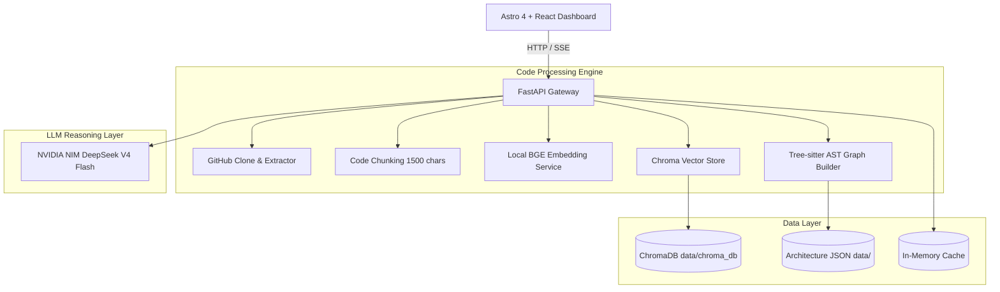

# 🕵️‍♂️ Repo Intelligence Agent

<p align="center">
  
  
  
  
  
  
</p>

<p align="center">
  <strong>An AI-powered repository intelligence platform for understanding, navigating, and planning changes across large codebases.</strong>
</p>

<p align="center">
  <a href="#-why-repo-intelligence-agent">Why Repo Intelligence Agent?</a> •
  <a href="#-key-features">Key Features</a> •
  <a href="#-system-architecture">System Architecture</a> •
  <a href="#-installation">Installation</a> •
  <a href="#-performance--validation">Validation Results</a> •
  <a href="docs/DEVELOPMENT_SETUP.md">Development Setup</a>
</p>

---

## 💡 Why Repo Intelligence Agent?

Navigating modern software repositories introduces significant friction for engineering teams:
- **Massive Codebases:** Sprawling modules make finding where logic resides an uphill battle.
- **Onboarding Difficulty:** New contributors struggle to find the right entry points and module flows.
- **Issue Localization:** Mapping a GitHub bug description to the exact files and functions requires deep tribal knowledge.
- **Architecture Discovery:** Static documentation goes stale; understanding active dependency graphs is slow.
- **Change Impact Uncertainty:** Modifying a utility file risks breaking unexpected downstream dependents.

**Repo Intelligence Agent** solves these problems by creating a local, semantic index of the repository. It parses abstract syntax trees (ASTs), extracts code dependencies, builds a directed graph of module relationships, and utilizes the DeepSeek LLM to answer developer queries, map bugs to code fixes, and visualize change propagation—completely grounded in your source code.

---

## ✨ Key Features

- **Repository Analysis:** Direct cloning, language detection, overlapping chunking, and local vector indexing.
- **Repository Chat:** Conversational Q&A over the codebase with streaming token responses (SSE) and strict source citations.
- **Architecture Builder:** Multi-language AST parsing (using Tree-sitter) and NetworkX dependency graph mapping.
- **Issue Mapper:** Automatically matches bug report text to target files, generating a clear step-by-step implementation plan.
- **Reading Order:** Generates an optimized file-reading list sorted by module centrality to accelerate developer onboarding.
- **Impact Analysis:** Traverses directed dependency graphs to predict which files will be affected by a proposed change.
- **Confidence Layer:** Evaluates responses for hallucination, returning confidence scores and warning flags.
- **Grounded Fallback Mode:** Falls back to keyword-based component mapping and chunk-grounded steps during LLM rate limits.

---

## 🎬 Demo

### Codebase Indexing & Analysis


### Conversational Repository Chat


### Issue Mapping & Code Planning


---

## 🏗️ System Architecture



### Data Processing Flow
```
GitHub Repository
   │
   ▼ [Clone & Extract]
Source Code Files
   │
   ▼ [CodeChunker: 1500 chars / 200 overlap]
Text Chunks
   │
   ▼ [EmbeddingService: BGE Small]
384-dimensional Vectors
   │
   ▼ [Index Repository]
ChromaDB Vector Database ──► Semantic Retrieval ──► DeepSeek LLM ──► Grounded Response
```

---

## 🛠️ Technology Stack

| Layer | Component | Notes |
|---|---|---|
| **Backend** | `FastAPI` + `Uvicorn` | Asynchronous routes, SSE streaming |
| **Frontend** | `Astro 4` + `React` | Component hydration, React Flow graph rendering |
| **Vector Store** | `ChromaDB` | Persistent, namespaces partitioned by repository |
| **Embeddings** | `BAAI/bge-small-en-v1.5` | 384-dim local sentence-transformers (no API calls) |
| **LLM Provider** | `DeepSeek V4 Flash` | Hosted on NVIDIA NIM (OpenAI-compatible) |
| **AST Parser** | `Tree-sitter` | Multi-language syntax trees parsing |
| **Graph Engine** | `NetworkX` | Node betweenness centrality calculations |

---

## 🚀 Installation & Local Development

### 1. Backend Server Setup
Ensure Python 3.10+ is installed:
```bash
# Set up virtual environment
python -m venv .venv
source .venv/bin/activate  # Or .venv\Scripts\activate on Windows

# Install dependencies
pip install -r requirements.txt

# Create environmental configuration
cp .env.example .env
# Open .env and add your DEEPSEEK_API_KEY from build.nvidia.com

# Start the API server
python -m uvicorn backend.api:app --host 127.0.0.1 --port 8000 --reload
```

### 2. Frontend Setup
Ensure Node.js 18+ is installed:
```bash
cd frontend
npm install
npm run dev
```

---

## 📊 Performance & Validation

Validation was conducted on the **Ankita15k/GitNest** repository (328 files, 1,549 chunks, 1,440 dependency edges):
- **Cloning & Indexing Success:** All source files embedded and stored in ChromaDB in ~28s.
- **Graph Builder Centrality:** Accurately extracted 17 application entry points and mapped high-coupling module hotspots.
- **Issue Mapper Recall:** Correctly localized file targets for sample bugs without returning hallucinated paths.

Refer to the complete [Validation Report](docs/VALIDATION_REPORT.md) for detailed telemetry.

---

## 🛑 Known Limitations

- **In-Memory Store:** The active repository session cache resets when the FastAPI backend process restarts.
- **CPU Bottleneck:** Embedded generation runs locally; CPU processing can take ~2–3 minutes for large repositories.
- **API Limits:** Free NVIDIA NIM keys are capped at ~3 requests per minute (automatically triggers fallback mode when exceeded).

---

## 🗺️ Roadmap

- **Near-Term:** Persistent SQLite database for processed repository lists, JWT API authentication middleware.
- **Medium-Term:** BM25 keyword matching + vector hybrid search, multi-repository comparing queries.
- **Long-Term:** CI/CD actions for PR risk scoring, VS Code IDE extension.

---

## 📄 License

Distributed under the MIT License. See [LICENSE](LICENSE) for details.
