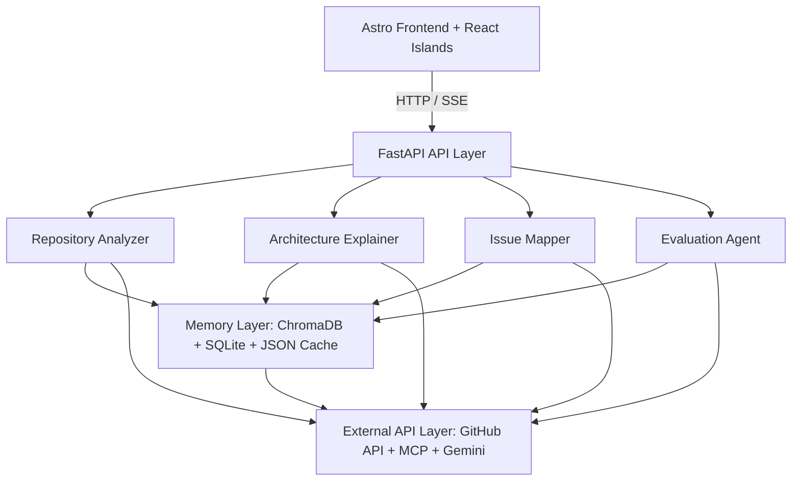

# 🔍 Repo Intelligence Agent

[](https://astro.build/)
[](https://fastapi.tiangolo.com/)
[](https://ai.google.dev/)
[](https://www.trychroma.com/)
[](LICENSE)


> **GitHub About**: AI-powered repository intelligence for developers. Analyze architecture, map issues, understand codebases, and accelerate open-source contributions.
>
> **GitHub Topics**: `ai`, `agents`, `gemini`, `astro`, `fastapi`, `developer-tools`, `open-source`, `repository-analysis`, `code-intelligence`, `chromadb`, `rag`
>
> **GitHub Topics (comma-separated)**: `ai, agents, gemini, astro, fastapi, developer-tools, open-source, repository-analysis, code-intelligence, chromadb, rag`

---

## 💡 Problem Statement

Developers spend a massive portion of their time reading and comprehending unfamiliar repositories before they can write a single line of meaningful code. Modern AI coding assistants excel at file-level autocomplete or single-file edits, but they struggle with **repository-level intelligence**. Understanding entry points, import flows, architectural decisions, and mapping an issue ticket to a multi-file code change checklist remains a slow, manual process.

**Repo Intelligence Agent** reduces contributor onboarding time from days to minutes by indexing repositories, tracing architectural relationships, mapping complex issues directly to the files requiring modification, and exposing this intelligence through an interactive, multi-agent workspace.

---

## 🎨 Screenshots

### Home Page
*Coming Soon*

### Repository Analysis
*Coming Soon*

### Issue Mapping
*Coming Soon*

### Repository Chat
*Coming Soon*

---

## 🎥 Demo

### Demo

Coming Soon

The demo will showcase:
* Repository Analysis
* Architecture Mapping
* Issue Mapping
* Repository Chat
* Architecture Graph

The goal is to demonstrate repository-level intelligence rather than file-level autocomplete.

---

## 🚀 Example Workflow

To see how the Repo Intelligence Agent delivers repository-level understanding, consider running it against a complex codebase:

* **Target Repository**: [langchain-ai/langchain](https://github.com/langchain-ai/langchain)
* **Example Questions**:
  * *How does memory work?*
  * *Where is the main entry point?*
  * *Which files should I modify to add a new retriever?*
  * *Explain the architecture.*

### Expected Output

Upon analysis, the agent generates a comprehensive intelligence packet:

1. **Repository Summary**: High-level purpose, tech stack, and structure detection.
2. **Architecture Graph**: Interactive module dependency map tracing relationships.
3. **Reading Order**: A curated step-by-step reading guide for developers to ramp up.
4. **Relevant Files**: Pinpointed classes, hooks, and files relevant to memory and retrievers.
5. **Implementation Plan**: A structured, file-by-file checklist detailing how to add the new retriever.

---

## 🏗️ Architecture Overview

The system utilizes a decoupled, modern web architecture to coordinate streaming agent operations with low-latency memory stores.



### Technical Stack & Decisions

* **Frontend**: Built with **Astro 4** and **React Islands**. Static portions are fast, and interactive features (like real-time chat, visual timeline, and terminal log streams) are powered by React components styled with **Tailwind CSS** and **shadcn/ui**.
* **Backend**: **FastAPI** handles high-throughput requests and streams progress and word-by-word conversational chat answers via Server-Sent Events (SSE).
* **AI & Agent Layer**: Orchestrated by **Antigravity Agents** running **Gemini 2.5 Flash** for repository-aware reasoning, combined with the **GitHub Model Context Protocol (MCP)** server for interacting with repository resources.
* **Memory & Storage**:
  * **ChromaDB**: Houses high-dimensional code snippet vector embeddings (using Gemini embeddings) for semantic search.
  * **SQLite**: Manages query histories, repository logs, saved issue plans, and index metadata.
  * **JSON Cache**: Minimizes Gemini API token overhead and stays clear of GitHub rate limits.

---

## 📂 Project Structure

```
repo-intelligence-agent/
├── agents/             # Specialized Python LLM agents
│   ├── analyzer.py     # Scans repo structure, tech stack, and dependencies
│   ├── explainer.py    # Explains system architecture and component relationships
│   ├── issue_mapper.py # Maps issues to codebase files and creates change plans
│   └── evaluator.py    # Quality check, citation validator, and confidence scorer
├── backend/            # FastAPI backend layer exposing agents to REST/SSE endpoints
│   ├── api.py          # FastAPI application server and endpoints
│   └── main.py         # Uvicorn entry point
├── docs/               # System architecture design documentation
├── frontend/           # Modern Astro + React + Tailwind CSS client dashboard
│   ├── src/
│   │   ├── components/  # Navbar and React interactive elements (Chat, FileTree, Dashboard, Timeline)
│   │   ├── layouts/     # Standard page wrappers with SEO meta tags
│   │   └── pages/       # File-based routing pages (Index, Chat, Issues, Analysis)
│   ├── astro.config.mjs
│   ├── tailwind.config.mjs
│   └── package.json
├── memory/             # Storage and retrieval layers
│   ├── cache.py        # Local JSON cache for query results
│   ├── chroma_store.py # ChromaDB client setup and document indexing
│   └── sqlite_store.py # SQLite database for tracking queries, issue plans, and repos
├── models/             # Shared Pydantic data schemas
│   └── schemas.py      # RepositoryAnalysis, ArchitectureSummary, ImplementationPlan, EvaluationResult
├── services/           # External service integration wrappers
│   ├── embedding_service.py # Gemini embeddings client
│   ├── github_service.py    # GitHub Repository cloning and issue retrieval
│   └── mcp_service.py       # Model Context Protocol integration
├── tests/              # Pytest backend API and agent unit tests
├── requirements.txt    # Python backend dependencies
└── .env.example        # Local environment configuration template
```

---

## 📊 Current Status

Current Progress:

✅ Architecture Foundation

✅ Astro Frontend Migration

🚧 Repository Intelligence Engine

🚧 Memory & Retrieval

⏳ Issue Intelligence

⏳ Evaluation Layer

⏳ Production Deployment

---

## 🎯 Roadmap & Milestones

- [x] **Milestone 1: Architecture Foundation** — Decoupled FastAPI backend skeleton, shared Pydantic schemas, mock endpoints, and test suites.
- [80%] **Milestone 2: Astro Frontend** 🚧 — Astro dashboard setup, Tailwind & shadcn styling, and React Islands for interactive widgets.
- [ ] **Milestone 3: Repository Intelligence** — Direct AST scanning, language parser services, and repository summarizer implementation.
- [ ] **Milestone 4: Memory & Retrieval** — ChromaDB indexing pipelines for code blocks and SQLite schemas for metadata.
- [ ] **Milestone 5: Issue Intelligence** — Issue mapper agent powered by semantic retrieval and plan-generation heuristics.
- [ ] **Milestone 6: Evaluation** — Citation-checking evaluator agent to run automated sanity checks.
- [ ] **Milestone 7: Production Deployment** — Containerization (Docker), deployment manifests, and production configuration.

---

## ✨ Future Vision

Repo Intelligence Agent aims to become a repository-aware engineering assistant capable of helping developers understand, navigate, and contribute to large codebases more effectively.

---

## 👥 Contributing

We welcome contributions from the open-source community!

1. Fork the repository.
2. Create a feature branch: `git checkout -b feature/cool-feature`.
3. Commit your changes: `git commit -m "Add some cool feature"`.
4. Push to the branch: `git push origin feature/cool-feature`.
5. Open a Pull Request.

Please see our [System Architecture](docs/architecture.md) for a technical deep-dive before writing code.

---

## 🔒 Open Source First

Repo Intelligence Agent is designed to help contributors navigate and understand large open-source codebases, making collaboration faster and more accessible. We believe that democratization of code-level intelligence empowers a wider and more diverse range of developers to participate in the open-source ecosystem.

---

## 📈 Why This Project Matters

Developers spend significant time understanding unfamiliar repositories before making meaningful contributions. Repo Intelligence Agent aims to reduce onboarding time by providing repository-level intelligence rather than file-level autocomplete. Focus areas include:

* **Repository-level intelligence**: Comprehending multi-file workflows and entry-point structures instead of single-line auto-completions.
* **Faster onboarding**: Providing curated reading lists and dependency routing to guide new developers in their onboarding process.
* **Open-source contribution workflows**: Automating the lookup from a GitHub issue description directly to targeted codebase paths.
* **Engineering productivity**: Empowering developers to answer complex repository questions using citations to save manual architecture reverse-engineering.

---

## 🛠️ Getting Started

Follow these steps to configure and boot up the application in a local development environment.

### 1. Configure Credentials
Copy `.env.example` to `.env` and fill in the required API keys and access tokens:
```bash
cp .env.example .env
```

### 2. Start the Backend API Server
1. Install Python dependencies:
   ```bash
   pip install -r requirements.txt
   ```
2. Start the FastAPI server on `http://127.0.0.1:8000`:
   ```bash
   python backend/main.py
   ```
3. Verify the API runs successfully by running the test suite:
   ```bash
   pytest
   ```

### 3. Start the Frontend Application
1. Navigate to the frontend directory:
   ```bash
   cd frontend
   ```
2. Install Node packages:
   ```bash
   npm install
   ```
3. Run the Astro development server on `http://localhost:4321`:
   ```bash
   npm run dev
   ```

Open `http://localhost:4321` in your browser. All frontend requests targeting `/api` will be proxied automatically to the Python server on port `8000`.

