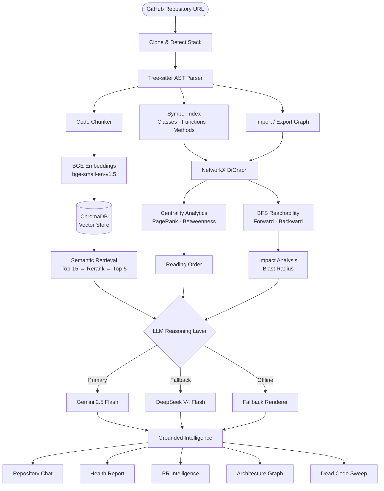
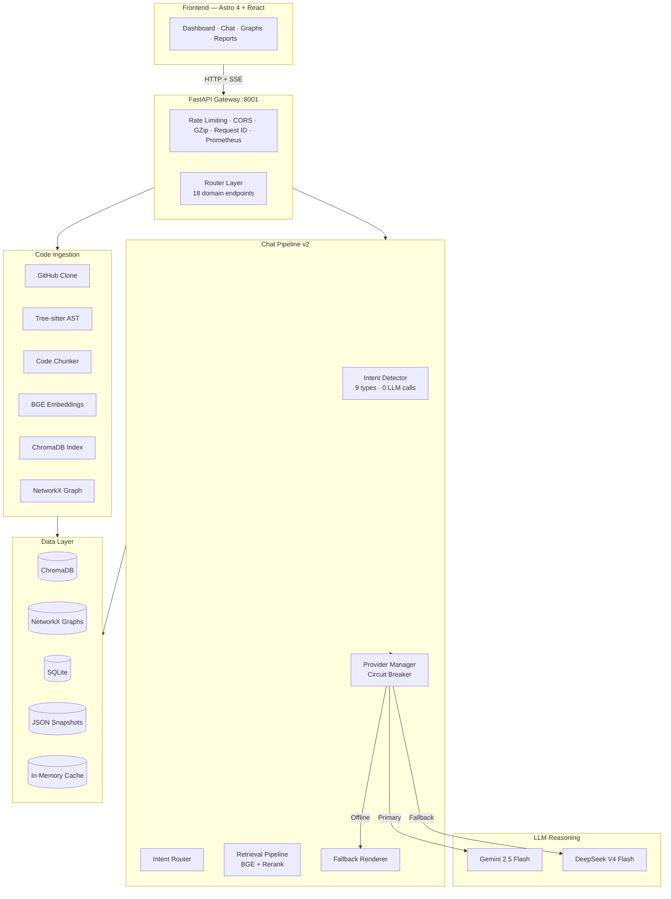
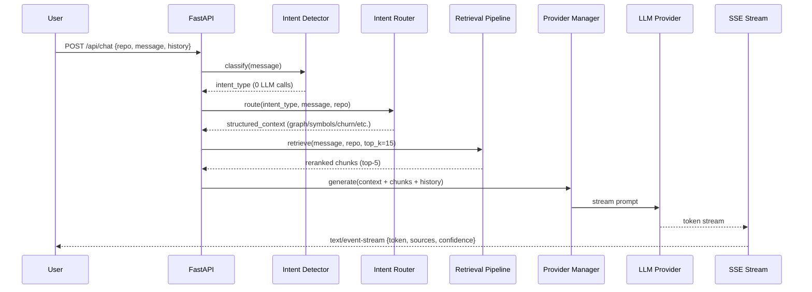
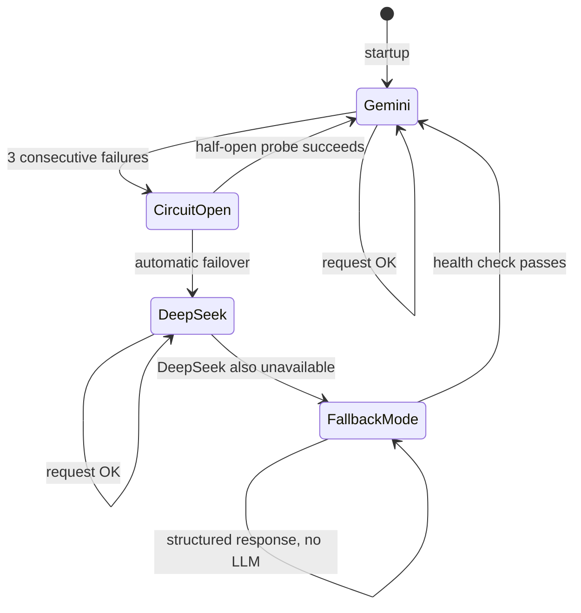
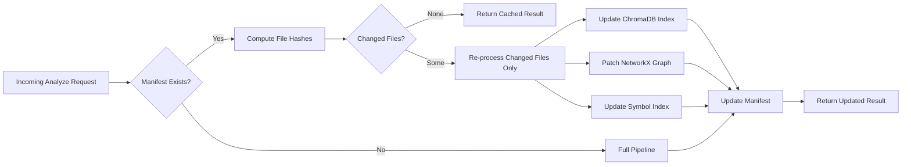

---

<div align="center">


<br />
<br />

# Repo Intelligence Agent

**Structural intelligence for any GitHub repository. Not just search — understanding.**

<br />

[](https://github.com/VarshithReddy2006/Repo-Intelligence-Agent/releases)
[](tests/)
[](https://python.org)
[](https://fastapi.tiangolo.com)
[](https://astro.build)
[](https://www.trychroma.com)
[](LICENSE)
[](PRODUCTION_RELEASE_REPORT.md)

<br />

[**Documentation**](docs/) · [**API Reference**](docs/API_REFERENCE.md) · [**Report a Bug**](https://github.com/VarshithReddy2006/Repo-Intelligence-Agent/issues) · [**Discussions**](https://github.com/VarshithReddy2006/Repo-Intelligence-Agent/discussions) · [**Architecture Spec**](ARCHITECTURE.md)

</div>

---

## What is this?

Repo Intelligence Agent is a production-grade codebase intelligence platform. Point it at any public GitHub repository and it returns a queryable knowledge graph — not a summarized blob of text, but a **structural model** of the codebase: symbols, imports, exports, dependency chains, call hierarchies, API surfaces, coupling hotspots, and architectural drift.

You can then chat with that model, generate onboarding reading orders, risk-score pull requests, detect dead code, and export an interactive health report — all grounded in the actual shape of the code, not keyword similarity.

It runs entirely on your machine. Zero data leaves your environment unless you choose a hosted LLM provider.

---

## The Problem

Most developers spend the first **days or weeks** on a new codebase just building a mental model of it. The same is true when returning to a project after months away, reviewing an unfamiliar PR, or trying to estimate the blast radius of a refactor.

Existing tools address parts of this, but none of them solve the core problem:

- **GitHub Copilot** autocompletes the line you're on. It doesn't know why a dependency exists.
- **Cursor** retrieves semantically similar code. It doesn't traverse import graphs.
- **Repository chat tools** built on naive RAG split files into text chunks and find similar passages. They hallucinate dependencies, miss downstream side effects, and have no awareness of the codebase's structural shape.
- **IDE navigation** shows you where a symbol is defined. It doesn't show you what breaks if you change it.
- **Documentation** is almost always out of date by the time you read it.

The missing piece is not better search. It is **structural reasoning** — the ability to answer questions that require understanding the relationships between modules, not just the content inside them.

---

## The Solution

Repo Intelligence Agent builds a **knowledge graph** over the repository before any LLM ever sees a prompt. Tree-sitter extracts every symbol, import, and export from each file. NetworkX turns those relationships into a directed dependency graph. BGE embeddings index each code chunk for semantic retrieval. Centrality algorithms determine reading order. BFS traversals compute blast radius.

Every response is grounded in this graph. When you ask "what breaks if I change this class?", the answer comes from a reachability sweep — not a guess.



---

## Screenshots

> **Note:** Replace the paths below with actual screenshots once the UI is deployed. Recommended dimensions: 1400 × 900 for dashboard shots, 1400 × 700 for graph views.

<br />

**Main Dashboard**


<br />

**Repository Chat**


<br />

<table>
  <tr>
    <td width="50%">
      <strong>Dependency Graph</strong><br />
      
    </td>
    <td width="50%">
      <strong>Call Graph</strong><br />
      
    </td>
  </tr>
  <tr>
    <td width="50%">
      <strong>Repository Health Report</strong><br />
      
    </td>
    <td width="50%">
      <strong>PR Intelligence</strong><br />
      
    </td>
  </tr>
  <tr>
    <td width="50%">
      <strong>Dead Code Detection</strong><br />
      
    </td>
    <td width="50%">
      <strong>Reading Order</strong><br />
      
    </td>
  </tr>
</table>

---

## Demo

> Placeholder section — update with actual demo assets.

| Asset | Link |
|---|---|
| Walkthrough GIF | `docs/assets/demo.gif` |
| Video demo | `docs/assets/demo.mp4` |
| Live hosted demo | Coming soon |

```bash
# The fastest way to see it in action — analyze the FastAPI repository itself:
repo-intel analyze https://github.com/fastapi/fastapi
repo-intel report fastapi/fastapi
```

---

## Features

<details>
<summary><strong>Repository Chat (v2)</strong></summary>

<br />

Ask questions about any indexed repository in natural language. The v2 pipeline runs a rule-based intent classifier (nine intent types, zero LLM calls) before retrieval, so it routes architecture questions to the graph layer and symbol questions to the AST index before ever touching the vector store.

**Capabilities**
- Intent detection: architecture, dependency, symbol lookup, PR analysis, dead code, API surface, churn, explanation, general
- Tier-weighted reranking: AST hits rank above semantic hits for structural queries
- Conversation memory with pronoun resolution across turns
- Token-by-token SSE streaming
- Source citations with file paths and confidence scores

**Example**
```bash
curl -N -X POST http://localhost:8001/api/chat \
  -H "Content-Type: application/json" \
  -d '{
    "repo": "fastapi/fastapi",
    "message": "What files would break if I removed the Depends() class?",
    "history": []
  }'
```

</details>

<details>
<summary><strong>Architecture Intelligence & Dependency Graph</strong></summary>

<br />

Every import and export relationship in the codebase is extracted via Tree-sitter AST parsing and stored as a directed graph in NetworkX. The frontend renders this as an interactive React Flow canvas with search, neighborhood inspection, and BFS reachability traces.

**Capabilities**
- Forward reachability: "what does this module depend on?"
- Backward reachability: "what depends on this module?"
- Neighborhood inspection: first and second-degree connections
- Full-graph view with centrality-based node sizing
- Architecture summary generated from graph metrics

**Use cases:** Onboarding, refactoring planning, dependency audit, architecture documentation

</details>

<details>
<summary><strong>Call Graph Intelligence</strong></summary>

<br />

Function-level call relationships extracted via AST analysis. Goes beyond file-level dependencies to show exactly which functions call which — and what the downstream effect of changing any function is.

**Capabilities**
- Callers and callees for any function
- Hierarchy traversal to configurable depth
- Blast radius estimation with weighted impact scores
- BFS traces from any entry point

</details>

<details>
<summary><strong>Reading Order Generation</strong></summary>

<br />

New contributors shouldn't have to guess where to start reading. The reading order feature applies PageRank and betweenness centrality to the dependency graph to produce a ranked list of files ordered by structural importance — the files that, if understood first, unlock the rest of the codebase fastest.

**Output:** Ordered file list with centrality scores and rationale for each rank position.

</details>

<details>
<summary><strong>API Surface Intelligence</strong></summary>

<br />

Classifies every exported symbol in the codebase as public, internal, or deprecated. Computes Martin's instability metrics (afferent coupling / (afferent + efferent coupling)) per module. Detects breaking changes between two repository snapshots.

**Capabilities**
- Symbol classification: public, internal, deprecated
- Instability index per module (0 = stable, 1 = unstable)
- Breaking change detection between versions
- Full API surface export

</details>

<details>
<summary><strong>Dead Code Detection</strong></summary>

<br />

Performs a full reachability sweep from all detected entry points (main files, exported public APIs, test entry points) across the dependency graph. Files that are never reached are flagged as dead code candidates, along with their full orphaned dependency chains.

**Output:** Ranked cleanup list with weighted scores (0–100) per candidate, plus dependency chains that can be safely removed together.

</details>

<details>
<summary><strong>PR Intelligence & Architecture Drift</strong></summary>

<br />

Risk-score a pull request before it merges. The PR analyzer computes blast radius from the changed file set, scores PR size (XS → XL), detects architectural drift by virtually applying the diff to the dependency graph, and summarizes symbol-level changes.

**Risk dimensions:** Size · Blast Radius · Coupling Impact · Architectural Drift  
**Risk levels:** LOW · MEDIUM · HIGH · CRITICAL · EXTREME

</details>

<details>
<summary><strong>Git History & Churn Analysis</strong></summary>

<br />

Mines the full git commit history to compute per-file churn scores. Identifies hotspot files — the intersection of high churn and high coupling — which are statistically the most likely source of future bugs and regressions.

**Output:** Weekly activity timeline, top hotspot files ranked by churn × coupling score, and commit frequency heatmap.

</details>

<details>
<summary><strong>Issue Mapping</strong></summary>

<br />

Takes a GitHub issue URL or body and maps it to the most relevant source files. Uses BGE embedding retrieval to find candidate files, then makes two LLM calls: one to rank and filter candidates, one to generate a grounded implementation plan. Results are cached to avoid redundant API calls.

</details>

<details>
<summary><strong>Repository Intelligence Report (v3.0)</strong></summary>

<br />

The flagship output. Aggregates all analysis dimensions into a single scored health report. Exported in three formats:

- **HTML** — Interactive, expandable, dark/light mode
- **PDF** — Print-optimized for sharing with stakeholders
- **Markdown** — Collapsible sections for GitHub PR comments

**Scored dimensions:** Architecture Stability · API Quality · Code Hygiene · Hotspot Risk · Onboarding Clarity

</details>

<details>
<summary><strong>Incremental Analysis</strong></summary>

<br />

The full analysis pipeline only needs to run once per repository. Subsequent runs compute a file-level diff using SHA hashes and re-process only the changed files. On a small change set this completes in under two seconds.

A schema-versioned analysis manifest ensures cached results are invalidated automatically when the pipeline version changes.

</details>

---

## How It Compares

The goal here is not to position against competitors — it's to be honest about what each tool is designed to do.

| Capability | Repo Intelligence Agent | Code Chat (RAG) | IDE Copilot | Sourcegraph |
|---|:---:|:---:|:---:|:---:|
| AST structural analysis | ✅ | ❌ | ❌ | ✅ |
| NetworkX dependency graph | ✅ | ❌ | ❌ | Partial |
| Function-level call graph | ✅ | ❌ | Partial | Partial |
| Dead code detection | ✅ | ❌ | ❌ | ❌ |
| PR blast radius scoring | ✅ | ❌ | ❌ | ❌ |
| Centrality-ranked reading order | ✅ | ❌ | ❌ | ❌ |
| Architecture drift detection | ✅ | ❌ | ❌ | ❌ |
| Churn × coupling hotspots | ✅ | ❌ | ❌ | Partial |
| Exportable health report | ✅ | ❌ | ❌ | ❌ |
| Self-hosted, fully local | ✅ | ✅ | ❌ | Partial |
| Multi-provider LLM failover | ✅ | Varies | ❌ | ❌ |
| Circuit breaker + offline mode | ✅ | ❌ | ❌ | ❌ |

The fundamental difference: tools built on naive RAG retrieve text chunks that are *similar* to your query. This platform retrieves graph nodes that are *structurally relevant* to your query, then uses text similarity as a secondary signal.

---

## Architecture

### System Overview



### Repository Chat Pipeline



### Provider Failover



### Incremental Build Pipeline



---

## Tech Stack

### Backend

| Component | Technology | Purpose |
|---|---|---|
| API Framework | FastAPI 0.110+ | Async HTTP and SSE endpoints |
| AST Parser | Tree-sitter | Language-agnostic structural parsing |
| Graph Engine | NetworkX | Dependency graph, BFS, centrality |
| Embedding Model | BGE-small-en-v1.5 | Code chunk embeddings |
| Vector Store | ChromaDB | Persistent vector index |
| Primary LLM | Gemini 2.5 Flash | Main reasoning provider |
| Fallback LLM | DeepSeek V4 Flash | NVIDIA NIM via OpenAI-compatible API |
| Relational DB | SQLite | Reports, migrations, analysis metadata |
| Settings | Pydantic Settings | Typed environment variable management |
| Server | Uvicorn | ASGI server with watch-dir filtering |

### Frontend

| Component | Technology | Purpose |
|---|---|---|
| Framework | Astro 4 | Static + islands architecture |
| UI Layer | React 18 | Interactive components |
| Language | TypeScript | Type safety |
| Styling | TailwindCSS | Utility-first styling |
| Graph Rendering | React Flow | Interactive dependency and call graphs |
| Streaming | SSE (EventSource) | Token-by-token chat streaming |

### Infrastructure & Tooling

| Component | Technology | Purpose |
|---|---|---|
| Containerization | Docker + Compose | Dev and production environments |
| Metrics | Prometheus | Request counts, latency, cache stats |
| Testing | pytest | 535 tests, mock LLM/GitHub boundaries |
| Linting | ruff | Python linting and formatting |
| Serialization | Pydantic | Request/response validation |
| Package | pip + editable install | `repo-intel` CLI entry point |

---

## Quick Start

The fastest path to a running instance:

```bash
# 1. Clone and install
git clone https://github.com/VarshithReddy2006/Repo-Intelligence-Agent.git
cd Repo-Intelligence-Agent
python -m venv .venv && source .venv/bin/activate
pip install -e .

# 2. Configure
cp .env.example .env
# Add your GEMINI_API_KEY (or DEEPSEEK_API_KEY) to .env

# 3. Start backend
python backend/main.py

# 4. Start frontend (separate terminal)
cd frontend && npm install && npm run dev

# 5. Analyze a repository
repo-intel analyze https://github.com/fastapi/fastapi
```

Backend: `http://localhost:8001` · Frontend: `http://localhost:4321` · API docs: `http://localhost:8001/docs`

---

## Installation

### Prerequisites

| Requirement | Version | Notes |
|---|---|---|
| Python | 3.10, 3.11, or 3.12 | 3.13 not yet tested |
| Node.js | 18+ | For the frontend only |
| Git | Any recent version | Required for repository cloning |
| Disk space | ~2 GB | BGE embedding model cache |

### Backend

```bash
# Clone
git clone https://github.com/VarshithReddy2006/Repo-Intelligence-Agent.git
cd Repo-Intelligence-Agent

# Virtual environment
python -m venv .venv
source .venv/bin/activate          # macOS / Linux
# .venv\Scripts\activate           # Windows

# Install package and CLI
pip install -e .
```

### Frontend

```bash
cd frontend
npm install
npm run dev        # Development server at http://localhost:4321
npm run build      # Production build
npm run preview    # Preview production build
```

### Docker

**Production:**
```bash
docker compose -f docker-compose.prod.yml up -d --build
```

Mounts named volumes for `data/` (ChromaDB, graphs, SQLite) and the cloned repository cache.

**Development (hot reload):**
```bash
docker compose -f docker-compose.dev.yml up -d --build
```

---

## Configuration

Copy the example and edit:

```bash
cp .env.example .env
```

### Environment Variables

**LLM Providers**

| Variable | Required | Default | Description |
|---|---|---|---|
| `LLM_PROVIDER` | Yes | `gemini` | Active provider: `gemini` or `deepseek` |
| `GEMINI_API_KEY` | If using Gemini | — | Google AI Studio key |
| `GEMINI_MODEL` | No | `gemini-2.5-flash` | Gemini model variant |
| `DEEPSEEK_API_KEY` | If using DeepSeek | — | NVIDIA NIM API key |
| `DEEPSEEK_BASE_URL` | No | `https://integrate.api.nvidia.com/v1` | NIM base URL |
| `DEEPSEEK_MODEL` | No | `deepseek-ai/deepseek-v4-flash` | DeepSeek model variant |

**Data & Storage**

| Variable | Required | Default | Description |
|---|---|---|---|
| `GITHUB_TOKEN` | Recommended | — | GitHub PAT for cloning and API access |
| `SQLITE_DB_PATH` | No | `data/repo_understanding.db` | SQLite database path |
| `CHROMA_DB_PATH` | No | `data/chroma_db` | ChromaDB persistence directory |
| `CLONED_REPOS_PATH` | Recommended | `~/.repo_intelligence/cloned_repos` | Clone destination — must be outside the project tree to avoid triggering uvicorn reload |

**Server**

| Variable | Required | Default | Description |
|---|---|---|---|
| `API_SERVER_HOST` | No | `0.0.0.0` | Uvicorn bind host |
| `API_SERVER_PORT` | No | `8001` | Uvicorn bind port |
| `FRONTEND_URL` | No | `http://localhost:4321` | Allowed CORS origin |
| `APP_ENV` | No | `development` | `development` or `production`. Production mode enables fail-fast on invalid credentials |
| `RATE_LIMIT_PER_MINUTE` | No | `60` | Max requests per IP per minute |
| `LOG_LEVEL` | No | `INFO` | Logging verbosity |
| `LOG_FORMAT` | No | `human` | `human` for local dev, `json` for production |

**Verify health after startup:**
```bash
curl http://localhost:8001/health
```
```json
{
  "backend": "online",
  "llm_provider": "gemini",
  "llm_model": "gemini-2.5-flash",
  "embedding_provider": "BAAI/bge-small-en-v1.5",
  "vector_db": "chromadb",
  "status": "healthy"
}
```

---

## Usage

### CLI

```bash
# Analyze a repository
repo-intel analyze https://github.com/pallets/flask

# Generate a health report (HTML)
repo-intel report pallets/flask

# Generate a health report (Markdown, for PR comments)
repo-intel report pallets/flask --markdown

# Generate a PDF-ready HTML report
repo-intel report pallets/flask --pdf -o report.html
```

### REST API

**Analyze a repository (SSE progress stream):**
```bash
curl -N -X POST http://localhost:8001/api/analyze \
  -H "Content-Type: application/json" \
  -d '{"url": "https://github.com/pallets/flask", "branch": "main"}'
```

**Chat with a repository:**
```bash
curl -N -X POST http://localhost:8001/api/chat \
  -H "Content-Type: application/json" \
  -d '{
    "repo": "pallets/flask",
    "message": "How is the application context implemented and what modules depend on it?",
    "history": []
  }'
```

**Get the dependency graph (React Flow format):**
```bash
curl http://localhost:8001/api/architecture/pallets/flask/graph
```

**Analyze a pull request:**
```bash
curl -X POST http://localhost:8001/api/pr/analyze \
  -H "Content-Type: application/json" \
  -d '{"repo": "pallets/flask", "pr_number": 5400}'
```

**Run a dead code sweep:**
```bash
curl -X POST http://localhost:8001/api/dead-code/analyze \
  -H "Content-Type: application/json" \
  -d '{"repo": "pallets/flask"}'
```

**Build and download the intelligence report:**
```bash
curl -X POST http://localhost:8001/api/v1/report/pallets/flask/build
curl -o report.html "http://localhost:8001/api/v1/report/pallets/flask/download?format=html"
curl -o report.md   "http://localhost:8001/api/v1/report/pallets/flask/download?format=markdown"
```

---

## Repository Chat

The chat pipeline is not a thin wrapper around an LLM. It is a multi-stage intelligence pipeline:

### Stage 1 — Intent Detection
A rule-based classifier (no LLM call, no latency cost) determines which of nine intent types the message belongs to: architecture, dependency, symbol lookup, PR analysis, dead code, API surface, churn, explanation, or general. This determines which structured services run before retrieval.

### Stage 2 — Intent Routing
The intent router calls the appropriate structured service. An architecture question queries the NetworkX graph. A symbol question queries the AST index. A churn question fetches commit history data. The result is a structured context object.

### Stage 3 — Vector Retrieval & Reranking
BGE embeddings retrieve the top-15 semantically relevant chunks. A tier-weighted reranker promotes AST-indexed chunks above generic text chunks for structural queries. The top-5 survive into the prompt.

### Stage 4 — Context Assembly
Token budgeting assembles the final prompt: conversation memory (with pronoun resolution across turns), structured context from Stage 2, reranked chunks from Stage 3, and the current message. The budget is respected to prevent context overflow.

### Stage 5 — Provider Manager
The Provider Manager holds a circuit breaker per provider. After three consecutive failures, the breaker opens and the system automatically fails over: Gemini → DeepSeek → Fallback Renderer. Recovery is automatic via health probes. Every response includes source citations and a confidence score.

### Stage 6 — Streaming
Responses stream token-by-token via Server-Sent Events. The final event carries `"status": "done"` along with the `sources` array and `confidence` score.

**Provider management endpoints:**
```bash
# Check provider health
curl http://localhost:8001/api/chat/health

# Hot-reload provider after changing .env
curl -X POST http://localhost:8001/api/chat/reload
```

---

## Repository Intelligence Report

The report aggregates every analysis dimension into a single exportable document.

**Five scored dimensions (0–100 each):**

| Dimension | What It Measures |
|---|---|
| Architecture Stability | Coupling metrics, instability index, graph density |
| API Quality | Symbol classification, breaking change exposure, public API ratio |
| Code Hygiene | Dead code volume, orphaned modules, deprecated symbol count |
| Hotspot Risk | Churn × coupling intersection, top-10 highest-risk files |
| Onboarding Clarity | Graph connectivity, documentation coverage, reading order coherence |

**Export formats:**
- **HTML** — Interactive, expandable sections, dark/light toggle, print-ready styles
- **PDF** — Optimized for stakeholder sharing (generated from the HTML renderer)
- **Markdown** — Collapsible GitHub-flavored markdown, designed for PR comment threads

```bash
# All three formats:
curl -o report.html "http://localhost:8001/api/v1/report/{owner}/{repo}/download?format=html"
curl -o report.pdf  "http://localhost:8001/api/v1/report/{owner}/{repo}/download?format=pdf"
curl -o report.md   "http://localhost:8001/api/v1/report/{owner}/{repo}/download?format=markdown"
```

---

## Performance

All measurements taken on a MacBook Pro M3, 16 GB RAM, against the FastAPI repository (~300 source files).

| Operation | Typical Duration |
|---|---|
| Fresh repository analysis (~300 files) | 25–45 s |
| Incremental rebuild (small change set) | < 2 s |
| Architecture graph build | ~1.8 s |
| PR analysis | ~1.5 s |
| Chat first token (streaming) | < 3 s |
| Chat streaming throughput | 50–90 ms / token |
| Dead code sweep | ~3 s |
| Churn analysis | ~4 s (depends on git history depth) |

**Prometheus metrics** available at `/metrics`:

| Metric | Description |
|---|---|
| `http_requests_total` | Request counts by method, path, status |
| `active_requests_count` | In-flight request gauge |
| `build_duration_seconds` | Per-repository build durations |
| `analysis_task_duration_seconds` | Per-task durations |
| `cache_hits_total` / `cache_misses_total` | Cache efficiency ratio |

---

## Project Structure

```
Repo-Intelligence-Agent/
│
├── backend/                        # FastAPI application
│   ├── api.py                      # App factory, middleware, router registration
│   ├── main.py                     # Uvicorn entry point with watch-dir filtering
│   ├── settings.py                 # Pydantic Settings — all env vars typed here
│   ├── dependencies.py             # Service singletons and analysis store
│   ├── security_middleware.py      # Sliding window rate limiter per IP
│   ├── logging_middleware.py       # Request ID injection per request
│   ├── metrics_middleware.py       # Prometheus counters and histograms
│   └── routers/                    # One router per feature domain
│
├── services/                       # All business logic lives here
│   ├── chat/                       # Chat v2 pipeline package
│   │   ├── retrieval_pipeline.py   # Authoritative pipeline orchestrator
│   │   ├── intent_detector.py      # Rule-based classifier, 9 intent types
│   │   ├── intent_router.py        # Routes intents to structured services
│   │   ├── conversation_memory.py  # Session memory + pronoun resolution
│   │   ├── retrieval.py            # Tier-weighted reranking (top-15 → top-5)
│   │   ├── context_builder.py      # Token budgeting and prompt assembly
│   │   ├── provider_manager.py     # Circuit breaker + automatic failover
│   │   └── fallback_renderer.py    # Structured response without LLM
│   │
│   ├── llm/                        # LLM provider abstraction layer
│   │   ├── base_provider.py        # Abstract interface + ProviderHealth model
│   │   ├── gemini_provider.py      # Gemini 2.5 Flash implementation
│   │   ├── deepseek_provider.py    # DeepSeek via NVIDIA NIM (OpenAI-compatible)
│   │   ├── provider_factory.py     # Singleton + hot-reload + startup validation
│   │   └── provider_errors.py      # Error classification for circuit breaker
│   │
│   ├── report/                     # Intelligence report generation
│   │   ├── composer.py             # Assembles ReportDataModel from all services
│   │   └── renderer.py             # HTML, Markdown, and PDF renderers
│   │
│   └── *.py                        # Architecture, graph, symbol, PR, drift, churn, etc.
│
├── agents/                         # Agent classes
│   └── issue_mapper.py             # GitHub issue → implementation plan
│
├── core/                           # Infrastructure
│   ├── cache.py                    # Schema-versioned in-memory analysis cache
│   ├── metrics.py                  # Prometheus registry
│   ├── repository_context.py       # Lazy-loaded repository state container
│   ├── change_detector.py          # SHA-based file change detection
│   ├── analysis_registry.py        # DAG task registry
│   └── build_pipeline.py           # DAG orchestration for incremental builds
│
├── memory/                         # Storage adapters
│   └── chroma_store.py             # ChromaDB read/write/delete adapter
│
├── models/                         # Pydantic domain models
├── storage/                        # JsonSnapshotStore and SQLite migrations
│
├── frontend/                       # Astro 4 + React dashboard
│   ├── src/
│   │   ├── pages/                  # Astro pages (file-based routing)
│   │   ├── components/             # React components (chat, graphs, reports)
│   │   └── layouts/                # Shared page layouts
│   └── package.json
│
├── tests/                          # 535 passing tests
│   ├── unit/                       # Pure unit tests with mocked dependencies
│   ├── integration/                # Service-layer integration tests
│   └── conftest.py                 # Shared fixtures, mock LLM/GitHub adapters
│
├── docs/                           # Extended documentation
│   ├── API_REFERENCE.md            # Full request/response documentation
│   └── assets/                     # Screenshots, diagrams, banner
│
├── ARCHITECTURE.md                 # Full component diagrams and math models
├── SECURITY.md                     # Responsible disclosure and security model
├── CONTRIBUTING.md                 # Development workflow and coding standards
├── PRODUCTION_RELEASE_REPORT.md    # Production audit (score: 92/100)
├── .env.example                    # Environment template
└── pyproject.toml                  # Package metadata, CLI entry points
```

---

## Testing

```bash
# Run the full test suite
pytest tests/ -v

# Run with coverage report
pytest tests/ --cov=. --cov-report=term-missing

# Run a specific domain
pytest tests/unit/test_intent_detector.py -v
pytest tests/integration/test_chat_pipeline.py -v
```

> **Important:** Always run `pytest tests/` and not `pytest` from the repo root. The root-level `pytest` traversal enters `data/` and attempts to import cloned repository code.

**535 tests across three categories:**

| Category | Count | What it covers |
|---|---|---|
| Unit | ~320 | Individual service functions, graph algorithms, intent classifier, providers |
| Integration | ~180 | Full pipeline runs with mock LLM and GitHub boundaries |
| Service-layer | ~35 | End-to-end API route tests with real SQLite, mock vector store |

All LLM and GitHub API calls are intercepted by mock adapters in `conftest.py`. The test suite runs without consuming any API quota.

---

## Security

| Control | Implementation |
|---|---|
| Rate limiting | Sliding window, 60 req/min per IP (configurable via `RATE_LIMIT_PER_MINUTE`). `/health` and `/metrics` are exempt. |
| CORS | Restricted to `FRONTEND_URL`. Set this to your production domain before deploying. |
| Input validation | Pydantic validates every request body. Malformed requests return 422 before reaching business logic. |
| Secrets | API keys are loaded exclusively from environment variables. They are never logged, echoed in responses, or written to disk. |
| LLM auth | All providers are health-checked at startup. Invalid credentials trigger a fail-fast error in production mode (`APP_ENV=production`) with an actionable message. |
| Authentication | None built-in — this is a single-user local tool by default. For multi-tenant or public deployments, place a reverse proxy with authentication in front of port 8001. |

See [SECURITY.md](SECURITY.md) for the responsible disclosure policy.

---

## Roadmap

**Completed — v1.0.0**
- [x] Tree-sitter AST parsing (Python, TypeScript, JavaScript)
- [x] NetworkX dependency and call graphs
- [x] BGE embedding + ChromaDB vector index
- [x] Repository Chat v2 with intent detection
- [x] Architecture graph with React Flow
- [x] Dead code detection
- [x] PR intelligence and architecture drift
- [x] Git churn analysis
- [x] API surface intelligence with instability metrics
- [x] Issue mapper with implementation planning
- [x] Repository Intelligence Report (HTML / PDF / Markdown)
- [x] Incremental build pipeline with SHA manifests
- [x] Prometheus metrics
- [x] Circuit breaker with Gemini → DeepSeek → Fallback failover
- [x] 535 passing tests
- [x] Docker support (dev + production)

**In Progress**
- [ ] GitHub Actions integration — post intelligence report as PR comment automatically
- [ ] Additional language support: Go, Rust, Java
- [ ] WebSocket-based live graph updates (currently polling)
- [ ] Private repository support via GitHub App installation

**Future**
- [ ] VS Code extension: call graph and blast radius from the editor
- [ ] Multi-repository analysis: cross-repo dependency tracing
- [ ] Scheduled re-analysis with drift notifications
- [ ] Team collaboration features: shared analysis sessions
- [ ] Local embedding model options: reduce external dependency
- [ ] OpenTelemetry traces for distributed deployments

---

## Contributing

Contributions are welcome. The project has a well-defined service boundary model — most features live entirely within `services/` with no coupling to the FastAPI layer.

**Development workflow:**

```bash
# 1. Fork and clone
git clone https://github.com/YOUR_USERNAME/Repo-Intelligence-Agent.git

# 2. Create a feature branch
git checkout -b feat/your-feature-name

# 3. Install in development mode
pip install -e ".[dev]"

# 4. Make changes, add tests
pytest tests/ -v  # All 535 should still pass

# 5. Open a pull request against main
```

**Guidelines:**
- New services go in `services/` and must have corresponding tests in `tests/unit/`
- New endpoints go in `backend/routers/` and must have route-level tests
- All LLM and GitHub calls must go through mock adapters in tests — no real API calls in the test suite
- The intent classifier in `services/chat/intent_detector.py` is rule-based by design. Do not introduce LLM calls into the classification stage.

See [CONTRIBUTING.md](CONTRIBUTING.md) for the full coding standards and PR review process.

---

## API Reference

Full request/response documentation including all request bodies, response schemas, error codes, and SSE event formats: [docs/API_REFERENCE.md](docs/API_REFERENCE.md)

Interactive API docs (Swagger UI): `http://localhost:8001/docs`  
ReDoc: `http://localhost:8001/redoc`

<details>
<summary>View all 45 endpoints</summary>

| Method | Path | Description |
|---|---|---|
| `GET` | `/health` | System health and active provider |
| `GET` | `/metrics` | Prometheus metrics |
| `GET` | `/api/repos/examples` | Pre-configured example repositories |
| `GET` | `/api/repos/recent` | Recently analyzed repositories |
| `POST` | `/api/analyze` | Full analysis pipeline (SSE) |
| `POST` | `/api/index` | Vector-only indexing |
| `GET` | `/api/analysis/{owner}/{repo}` | Fetch analysis result |
| `POST` | `/api/repos/repair` | Rebuild missing symbol/graph indexes |
| `POST` | `/api/retrieve` | Vector search + LLM answer |
| `POST` | `/api/chat` | Streaming repository chat (SSE) |
| `GET` | `/api/chat/health` | Provider health diagnostic |
| `POST` | `/api/chat/reload` | Hot-reload LLM provider |
| `POST` | `/api/issues/map` | Map GitHub issue to implementation plan |
| `POST` | `/api/architecture/build` | Build dependency graph |
| `GET` | `/api/architecture/{owner}/{repo}` | Architecture summary |
| `GET` | `/api/architecture/{owner}/{repo}/graph` | React Flow dependency graph |
| `POST` | `/api/reading-order` | Onboarding reading order |
| `POST` | `/api/impact-analysis` | Change impact prediction |
| `GET` | `/api/graph/{owner}/{repo}/full` | Full interactive graph |
| `GET` | `/api/graph/{owner}/{repo}/neighbors/{path}` | Node neighborhood |
| `GET` | `/api/graph/{owner}/{repo}/trace/{path}` | BFS trace |
| `GET` | `/api/graph/{owner}/{repo}/search` | Graph node search |
| `GET` | `/api/symbols/{owner}/{repo}/file/{path}` | Symbols in file |
| `GET` | `/api/symbols/{owner}/{repo}/definition/{name}` | Symbol definition |
| `GET` | `/api/symbols/{owner}/{repo}/references/{name}` | Symbol references |
| `POST` | `/api/call-graph/build` | Build call graph (SSE) |
| `GET` | `/api/call-graph/{owner}/{repo}` | React Flow call graph |
| `GET` | `/api/call-graph/{owner}/{repo}/callers/{fn}` | Callers of a function |
| `GET` | `/api/call-graph/{owner}/{repo}/callees/{fn}` | Callees of a function |
| `GET` | `/api/call-graph/{owner}/{repo}/blast-radius/{fn}` | Function blast radius |
| `POST` | `/api/api-surface/build` | Build API surface index (SSE) |
| `GET` | `/api/api-surface/{owner}/{repo}` | Full API surface report |
| `GET` | `/api/api-surface/{owner}/{repo}/public` | Public symbols only |
| `GET` | `/api/api-surface/{owner}/{repo}/breaking` | Breaking change candidates |
| `POST` | `/api/churn/analyze` | Mine git history (SSE) |
| `GET` | `/api/churn/{owner}/{repo}` | Churn summary |
| `GET` | `/api/churn/{owner}/{repo}/hotspots` | Top hotspot files |
| `POST` | `/api/pr/analyze` | PR risk and blast radius |
| `GET` | `/api/pr/health` | PR intelligence diagnostics |
| `POST` | `/api/architecture/drift` | Architecture drift detection |
| `POST` | `/api/dead-code/analyze` | Dead code sweep |
| `POST` | `/api/v1/report/{owner}/{repo}/build` | Build intelligence report |
| `GET` | `/api/v1/report/{owner}/{repo}/summary` | Report health summary |
| `GET` | `/api/v1/report/{owner}/{repo}/download` | Download HTML / PDF / Markdown |

</details>

---

## Documentation

| Document | Description |
|---|---|
| [ARCHITECTURE.md](ARCHITECTURE.md) | Full component diagrams, math models, and sequence diagrams |
| [docs/API_REFERENCE.md](docs/API_REFERENCE.md) | Complete request/response documentation for all 45 endpoints |
| [CONTRIBUTING.md](CONTRIBUTING.md) | Development workflow, coding standards, PR guidelines |
| [SECURITY.md](SECURITY.md) | Security model and responsible disclosure policy |
| [PRODUCTION_RELEASE_REPORT.md](PRODUCTION_RELEASE_REPORT.md) | Full production audit (92/100, June 2026) |

---

## License

Distributed under the MIT License. See [LICENSE](LICENSE) for the full text.

---

## Acknowledgements

This project is built on a set of excellent open-source tools.

| Project | Role |
|---|---|
| [FastAPI](https://fastapi.tiangolo.com/) | Async API framework and OpenAPI documentation |
| [Tree-sitter](https://tree-sitter.github.io/) | Incremental AST parsing across multiple languages |
| [NetworkX](https://networkx.org/) | Graph construction, BFS, and centrality algorithms |
| [ChromaDB](https://www.trychroma.com/) | Local vector storage and similarity search |
| [sentence-transformers](https://www.sbert.net/) | BGE embedding model (BAAI/bge-small-en-v1.5) |
| [React Flow](https://reactflow.dev/) | Interactive dependency and call graph rendering |
| [Astro](https://astro.build/) | Frontend framework with islands architecture |
| [Google Gemini](https://ai.google.dev/) | Primary LLM reasoning provider |
| [NVIDIA NIM](https://build.nvidia.com/) | DeepSeek V4 Flash inference endpoint |
| [Pydantic](https://docs.pydantic.dev/) | Data validation and settings management |
| [Uvicorn](https://www.uvicorn.org/) | ASGI server |

---

<div align="center">

Built with the conviction that code intelligence should be structural, not statistical.

**[Star this repository](https://github.com/VarshithReddy2006/Repo-Intelligence-Agent)** if it saves you time understanding a codebase.

</div>
