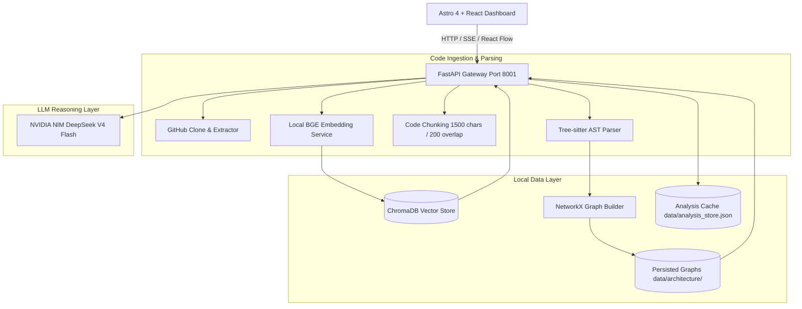

# 🕵️‍♂️ Repo Intelligence Agent

<p align="center">
  
  
  
  
  
  
</p>

<p align="center">
  <strong>An advanced codebase intelligence platform that combines AST structure extraction, dependency graph modeling, NetworkX centrality analysis, and LLM reasoning to map codebase architectures, onboarding reading orders, issue implementation plans, and change impact boundaries.</strong>
</p>

<p align="center">
  <a href="#-why-this-is-different-from-typical-repo-chatbots">Why This Is Different</a> •
  <a href="#-key-differentiators">Key Differentiators</a> •
  <a href="#-system-architecture">System Architecture</a> •
  <a href="ARCHITECTURE.md">Architecture Specification</a> •
  <a href="docs/DEVELOPMENT_SETUP.md">Development Setup</a> •
  <a href="docs/VALIDATION_REPORT.md">Validation & Telemetry</a> •
  <a href="RELEASE_NOTES.md">Release Notes</a>
</p>

---

## ⚡ Why this is different from typical Repo Chatbots

Traditional codebase assistants use a straightforward, unstructured approach:

```
Traditional RAG Chatbot:
Repo ──► Text Splitting ──► Vector Embeddings ──► Similarity Search ──► LLM Prompt
```

This model is blind to code structure, import inheritance, code coupling, and execution entry points. It often hallucinates dependencies, misses downstream side-effects, and generates unstructured code recommendations.

**Repo Intelligence Agent** addresses these gaps by implementing a structural, graph-augmented retrieval and reasoning architecture:

```
Repo Intelligence Agent Ingestion & Retrieval Pipeline:
Repo
  ├──► [Tree-sitter AST Parser] ──► Structural Declarations (Imports/Exports/Classes/Methods)
  │                                           │
  │                                           ▼
  │                              [NetworkX DiGraph Mapping]
  │                                           │
  ├───────────────────────────────────────────┼──────────────────────────────────────────┐
  ▼                                           ▼                                          ▼
[ChromaDB Vector Store]            [Centrality Analytics]                     [BFS Graph Traversals]
(1500 chars / 200 overlap)       (Suggested Reading Orders)                  (Change Impact Analysis)
  │                                           │                                          │
  ▼                                           ▼                                          ▼
Vector Snippets ───────────────► Architectural Graph Context ────────────────► Propagation Risk Scoring
  │                                           │                                          │
  └───────────────────────────────────────────┴──────────────────────────────────────────┘
                                              │
                                              ▼
                               [DeepSeek V4 Flash Reasoning]
                                              │
                                              ▼
                                Grounded Code Intelligence
```

By enriching semantic vector retrieval with explicit import graphs, centrality indicators, and structural declarations, the system accurately maps codebase relationships, onboarding order, implementation dependencies, and change impacts without hallucinating non-existent modules.

---

## ✨ Key Differentiators

### 1. Unified Repository Workspace
The frontend layout organizes repository navigation into a unified tabbed dashboard workspace:
- **Codebase Analysis:** Summary details, tech stack, and primary package declarations.
- **Architecture Graph:** A React Flow-rendered, interactive node-link import graph of source files.
- **Reading Path:** An ordered timeline sequence for codebase onboarding.
- **Impact Analysis:** Interactive scenario inputs predicting file risk spreads.
- **Issue Intelligence:** Step-by-step implementation guide generation.
- **Chat:** Conversational context-grounded Q&A interface.

The parent workspace component maintains a **shared repository session** in React state. Tab navigation is instantaneous, drawing from cached metadata with **no re-analysis** required when switching between views.

### 2. Session Store & Context Sync
Active repository sessions are synchronized across components and browser tabs. 
- **Persisted (localStorage):** `owner`, `repo`, `indexing status`, `graph status`, and `last analyzed timestamp`. This lets the application recover context immediately if the user reloads or navigates away.
- **Non-persisted (in-memory state):** Large dependency graph payloads, tree nodes, and transient UI states. This division prevents exceeding localStorage capacity limits (typically 5MB) while keeping load latency low.

### 3. Chat Resilience Layer
To prevent rate-limit interruptions (common on free-tier NVIDIA NIM keys), the system has an **automated grounded fallback mode**. When a rate limit exception (HTTP 429), network timeout, or provider failure occurs:
- The system intercepts the exception.
- It extracts local text snippets from the top similarity chunks retrieved from ChromaDB.
- It infers affected components using file path heuristics.
- It returns a structured, retrieval-grounded fallback response directly to the chat window with cited sources and confidence scores, ensuring no raw back-end exceptions reach the developer.

### 4. Analysis Persistence Lifecycle
Computed ingestion analyses are saved directly to `data/analysis_store.json`. Upon application startup, the backend hydrates this store, allowing full repository workspace recovery and details retrieval without having to rebuild graphs or regenerate embeddings.

---

## 🏗️ System Architecture

The following diagram illustrates the relationship between the client dashboard, the API gateway, local vector stores, and the DeepSeek inference layer:



---

## 🛠️ Technology Stack

| Layer | Component | Notes |
| :--- | :--- | :--- |
| **Backend** | `FastAPI` + `Uvicorn` | Asynchronous routers, SSE streams, binds to port **8001** |
| **Frontend** | `Astro 4` + `React` | Dynamic UI hydration, React Flow graph rendering |
| **Vector DB** | `ChromaDB` | Persistent code chunk database, partitioned via `repo_name` |
| **Embeddings** | `BAAI/bge-small-en-v1.5` | Local SentenceTransformers generating 384-dimensional vectors |
| **LLM Provider** | `DeepSeek V4 Flash` | Inference provider served via OpenAI-compatible NVIDIA NIM |
| **AST Parser** | `Tree-sitter` | Lazy-loaded language parsers (Python, JS, TS, JSX, TSX) |
| **Graph Calculations** | `NetworkX` | Directed dependency trees, BFS sweeps, composite centrality |

---

## 🛑 Known Limitations

- **CPU Ingestion Latency:** Locally executing SentenceTransformer embeddings on CPU takes approximately 2–3 minutes per 1,500 chunks.
- **NVIDIA NIM Rate Limits:** Free developer keys are capped at ~3 requests/minute. The system handles this with its automated fallback mode.
- **Stubbed Infrastructure:** `SQLiteStore` (`memory/sqlite_store.py`), `MCPService` (`services/mcp_service.py`), and `RepositoryAnalyzer` (`agents/analyzer.py`) are design stubs. Inlined routes and JSON storage cache operations handle these functions in the MVP.

---

## 📄 License

Distributed under the MIT License. See [LICENSE](LICENSE) for details.
