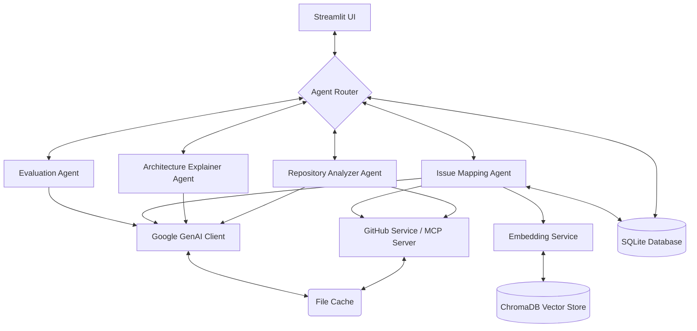

# System Architecture - Repo Understanding Agent

This document outlines the architecture, data flow, and agent interaction structure of the **Repo Understanding Agent**.

## System Overview

The system is designed around a multi-agent structure where specialized agents interact with a shared memory layer, service layer, and a Streamlit frontend interface.

## Architectural Components

### 1. Agent Layer (`agents/`)

* **Repository Analyzer Agent (`analyzer.py`)**: scans directories to map code structures, analyzes file trees, and extracts dependencies.
* **Architecture Explainer Agent (`explainer.py`)**: summarizes application flow, identifies core modules, and maps component interactions.
* **Issue Mapping Agent (`issue_mapper.py`)**: queries the code index to find files related to a specific issue/feature request, drafting implementation plan steps.
* **Evaluation Agent (`evaluator.py`)**: ensures generated plans or summaries do not hallucinate, checking sources against exact citations.

### 2. Memory Layer (`memory/`)

* **ChromaDB Vector Store (`chroma_store.py`)**: Stores code snippet embeddings generated via Google Gemini, enabling semantic search and code chunk retrieval.
* **SQLite Relational Store (`sqlite_store.py`)**: Manages structured histories, user sessions, repository indexing logs, and saved plan snapshots.
* **JSON File Cache (`cache.py`)**: Caches LLM completion prompts and GitHub API responses to minimize token costs, reduce API rate limits, and speed up execution.

### 3. Service Layer (`services/`)

* **GitHub Service (`github_service.py`)**: Authenticates and interacts with GitHub APIs to fetch repositories, code files, and issues list.
* **Embedding Service (`embedding_service.py`)**: Interfaces with Gemini Embedding API models (specifically `text-embedding-004`) to generate embeddings.
* **MCP Service (`mcp_service.py`)**: Manages context, permissions, and tool requests using Model Context Protocol (MCP) integrations.

### 4. Shared Models (`models/`)

* Defines shared Pydantic data schemas representing `RepositoryAnalysis`, `ArchitectureSummary`, `ImplementationPlan`, and `EvaluationResult` to enforce strict type checking and contract validations between all agents and components.

### 5. Frontend UI (`ui/`)

* A **Streamlit** dashboard implementing a unified workspace with tab controls for repository exploration, architecture documentation, implementation tracking, and evaluation scoring.

## Data Flow Workflow

1. **Repository Import**: User inputs repository details in the Streamlit UI. The `GitHubService` fetches repo files, which are scanned by `RepositoryAnalyzer`.
2. **Indexing**: Code chunks are passed to the `EmbeddingService` and written into the `ChromaStore`. Relational metadata is written to the `SQLiteStore`.
3. **Explaining**: The `ArchitectureExplainer` reads the metadata and asks Gemini to structure system explanations.
4. **Issue Mapping**: The user provides a GitHub issue. `IssueMapper` retrieves relevant files from `ChromaStore` and builds a step-by-step code plan.
5. **Guardrails Check**: The `EvaluationAgent` verifies the correctness of the plan, checks files list citations, and outputs a confidence score to the UI.
