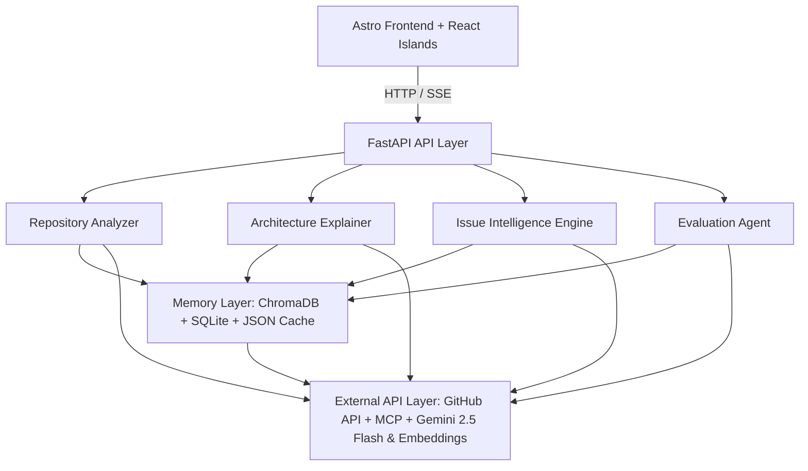

# System Architecture - Repo Intelligence Agent

This document outlines the architecture, data flow, and agent interaction structure of the **Repo Intelligence Agent**.

## System Overview

The system is designed around a modern decoupled architecture featuring an interactive Astro frontend and a high-performance FastAPI backend coordinating specialized LLM agents, a unified memory layer, and external integrations.

## Architectural Components

### 1. Frontend Layer (`frontend/`)

* **Astro 4**: Core web framework handling high-performance page rendering and routing.
* **React Islands**: Provides dynamic, interactive UI components (like live terminal stream, repository chat, and real-time timeline) embedded seamlessly in Astro pages.
* **Tailwind CSS**: Modern, highly polished, component-driven design system enforcing premium typography (Inter & JetBrains Mono) and responsive, grid-based layout controls in a dark developer theme.

### 2. Backend API Layer (`backend/`)

* **FastAPI**: Core Python web framework exposing clean REST APIs and real-time Server-Sent Events (SSE) to stream agent progress and conversational answers word-by-word.
* **Uvicorn**: High-performance ASGI web server.

### 3. Agent Layer (`agents/`)

* **Repository Analyzer (`analyzer.py`)** [Stub]: Reserved for future integration. Current repository scanning, language/framework detection, and dependency parsing are handled dynamically in the backend API layer (`backend/api.py`).
* **Architecture Explainer (`explainer.py`)** [Stub]: Reserved for future integration. Current architecture summary generation is handled dynamically in the backend API layer (`backend/api.py`).
* **Issue Mapper (`issue_mapper.py`)** [Implemented]: Maps external GitHub issue descriptions to specific code paths using semantic code search, drafting step-by-step implementation plans.
* **Evaluation Agent (`evaluator.py`)** [Implemented]: Validates generated code answers against exact citations, checks for hallucinations, and outputs confidence scores (0-100).

### 4. Memory & Storage Layer (`memory/`)

* **ChromaDB Vector Store (`chroma_store.py`)** [Implemented]: Stores code snippet embeddings generated via Gemini (`text-embedding-004`) to support semantic search and Retrieval-Augmented Generation (RAG).
* **SQLite Relational Store (`sqlite_store.py`)** [Stub]: Reserved for future database migrations. Currently not integrated into the live workspace execution pipeline.
* **JSON Cache (`cache.py`)** [Stub]: Reserved for future cache layers. Currently, the Issue Mapper implements its own direct file-based JSON caching strategy.

### 5. Services Layer (`services/`)

* **Gemini Client (`embedding_service.py`)** [Implemented]: Interfaces with the Gemini 2.5 Flash model for reasoning, and Gemini Embeddings for code chunk vectorization, complete with robust retry logic.
* **GitHub Service (`github_service.py`)** [Implemented]: Manages repository cloning, validation, file extraction, and branch handling.
* **Chunking Service (`chunking_service.py`)** [Implemented]: Splits source files into ~1500 character chunks with 200 character overlap, filtering out whitespace-only blocks.
* **Model Context Protocol (`mcp_service.py`)** [Stub]: Reserved for future integration.

## Data Flow Workflow

1. **Repository Import**: The user requests repository analysis via the **Astro Frontend**. The request routes to **FastAPI**, which clones the repository and extracts source files using `GitHubService`.
2. **Code Indexing**: Code files are chunked via `CodeChunker`, embedded via the Gemini Embeddings API via `EmbeddingService`, and stored in **ChromaDB**. High-level repo metadata and dependency maps are generated.
3. **Architecture Mapping**: The backend coordinates dynamic architecture mapping via Gemini 2.5 Flash, generating a summary of components and suggested reading order.
4. **Issue & Feature Planning**: The user submits a GitHub issue via the Issue Intelligence panel. The **Issue Mapper** performs a vector search over the index to find relevant files, reranks them, and drafts a targeted step-by-step implementation plan.
5. **Guardrail Evaluation**: Before returning the response, the **Evaluation Agent** reviews the generated checklist and code citations, determining if references are factual and producing a final confidence metric.
