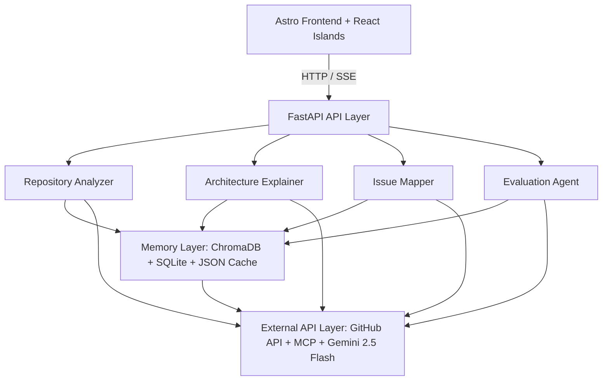

# System Architecture - Repo Intelligence Agent

This document outlines the architecture, data flow, and agent interaction structure of the **Repo Intelligence Agent**.

## System Overview

The system is designed around a modern decoupled architecture featuring an interactive Astro frontend and a high-performance FastAPI backend coordinating specialized LLM agents, a unified memory layer, and external integrations.

## Architectural Components

### 1. Frontend Layer (`frontend/`)

* **Astro**: Core web framework handling high-performance page rendering and routing.
* **React Islands**: Provides dynamic, interactive UI components (like live terminal stream, repository chat, and real-time timeline) embedded seamlessly in Astro pages.
* **Tailwind CSS & shadcn/ui**: Modern, highly polished, component-driven design system enforcing premium typography and responsive, grid-based layout controls.

### 2. Backend API Layer (`backend/`)

* **FastAPI**: Core Python web framework exposing clean REST APIs and real-time Server-Sent Events (SSE) to stream agent progress and conversational answers word-by-word.

### 3. Agent Layer (`agents/`)

* **Repository Analyzer (`analyzer.py`)**: Scans directories, parses package dependency files, and auto-detects languages/frameworks to build a repository profile.
* **Architecture Explainer (`explainer.py`)**: Resolves module graphs, identifies primary entry points, maps code structures, and details component interactions.
* **Issue Mapper (`issue_mapper.py`)**: Maps external GitHub issue descriptions to specific code paths using semantic code search, drafting step-by-step implementation plans.
* **Evaluation Agent (`evaluator.py`)**: Validates generated code answers against exact citations, checks for hallucinations, and outputs confidence scores.

### 4. Memory & Storage Layer (`memory/`)

* **ChromaDB Vector Store (`chroma_store.py`)**: Stores code snippet embeddings generated via Gemini to support semantic search.
* **SQLite Relational Store (`sqlite_store.py`)**: Tracks scanned repositories, saved implementation plans, query history, and metadata.
* **JSON Cache (`cache.py`)**: Caches LLM calls and GitHub API payloads to respect rate limits, reduce costs, and optimize speed.

### 5. Services Layer (`services/`)

* **Gemini Client**: Interfaces with the Gemini 2.5 Flash model for reasoning, embeddings, and code understanding.
* **GitHub Service**: Manages repository cloning, authentication, and issue pulling.
* **GitHub MCP Server**: Integrates Model Context Protocol tools for repository-aware actions.

## Data Flow Workflow

1. **Repository Import**: The user requests repository analysis from the **Astro Frontend**. The request routes to **FastAPI**, which invokes the **Repository Analyzer** to clone the repository and build the directory tree.
2. **Code Indexing**: Code files are chunked, embedded via the Gemini Embeddings API, and stored in **ChromaDB**. High-level repo metadata is persisted in **SQLite**.
3. **Architecture Mapping**: The **Architecture Explainer** analyzes the codebase skeleton, parses imports to map module relationships, and writes the graph data.
4. **Issue & Feature Planning**: The user submits a GitHub issue. The **Issue Mapper** performs a vector search over the index to find relevant files, then drafts a targeted step-by-step checklist.
5. **Guardrail Evaluation**: Before rendering the response, the **Evaluation Agent** reviews the generated checklist and code citations, evaluating accuracy and formatting metrics.

