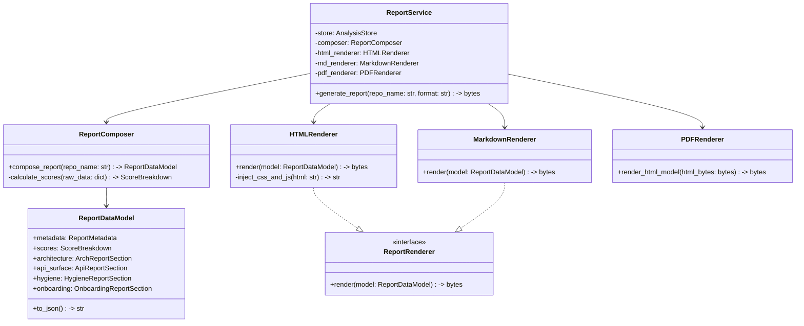

# RFC: Repository Intelligence Report (repo-intel report)

This RFC details the design and architecture for the **Repository Intelligence Report**, the flagship feature of the **Repo Intelligence Agent (v3.0)**. 

The goal of this feature is to turn the agent's advanced analysis capabilities into a unified, high-value, and polished user experience that answers the ultimate developer and management question: **"What is the true health and architecture of this codebase?"**

---

## 1. Executive Summary

### The "Why"
The Repo Intelligence Agent currently operates as a collection of advanced, disconnected diagnostic services (Symbol Index, Call Graph, Dead Code, API Surface, Git Churn, etc.). While technically sophisticated, developers and team leads must query these indices individually or write ad-hoc scripts to interpret the combined state of the codebase. 

The **Repository Intelligence Report** consolidates all existing analysis outputs into a single, cohesive, premium engineering report (HTML, PDF, Markdown, JSON). 

### Value Proposition
* **For Developers**: Provides an instant walkthrough of a new codebase (Reading Path), lists concrete areas that require refactoring (Dead Code, High-Coupling Cycles), and highlights hot-spots before starting a major task.
* **For Engineering Managers & Tech Leads**: Acts as an automated **Architecture Review** and **Code Quality Dashboard** (like an offline SonarQube with deep semantic graphs). Evaluates the repository health score over time.
* **For Recruiters & Technical Auditors**: Delivers a structured **Technical Due Diligence Report** summarizing architectural complexity, stability metrics, and maintainability.
* **For Open Source Maintainers**: Generates an authoritative status document to showcase codebase health and onboarding readability to potential contributors.

---

## 2. User Journey

```
                        ┌─────────────────────────────────┐
                        │      Developer / Lead runs      │
                        │      `repo-intel report .`      │
                        └────────────────┬────────────────┘
                                         │
                                         ▼
                        ┌─────────────────────────────────┐
                        │   BuildPipeline completes CLI   │
                        │    Analysis (JSON cached)       │
                        └────────────────┬────────────────┘
                                         │
                                         ▼
                        ┌─────────────────────────────────┐
                        │    Report Generator Engine      │
                        │  composes and renders output    │
                        └──────┬───────────────────┬──────┘
                               │                   │
                               ▼                   ▼
                     ┌───────────┐           ┌───────────┐
                     │   HTML    │           │ Markdown  │
                     └─────┬─────┘           └─────┬─────┘
                           │                       │
                           ▼                       ▼
                     ┌───────────┐           ┌───────────┐
                     │   PDF via   │           │ GitHub PR │
                     │ Headless  │           │ Comment   │
                     └───────────┘           └───────────┘
```

1. **Local Terminal Invocation**: A developer runs `repo-intel report` inside their local project directory. The CLI checks if a cached analysis is available; if not, it triggers `repo-intel analyze` to build/update the database.
2. **HTML Generation & Interactive Dashboard**: The engine generates a single-file, self-contained interactive HTML report (embedded stylesheets and assets) that opens immediately in the browser. It features glassmorphism, responsive tabs, and interactive SVG dependency diagrams.
3. **PDF Export**: The HTML contains print-friendly CSS styles allowing seamless conversion to a multi-page PDF via standard browser print commands or headless rendering.
4. **CI/CD Pull Request Feedback**: On a Pull Request, the GitHub Action triggers a delta report, outputting a highly readable Markdown summary detailing the impact of the change (Blast Radius, Architecture Drift) directly in the PR comments.
5. **IDE / MCP Integration**: The MCP server exposes the path to the latest generated report. Code assistants (like Claude or Cursor) read the report summary JSON to gain high-level context of the repository's hot spots and architecture before answering queries.

---

## 3. Report Structure

The generated report is structured into the following sections:

### I. Executive Summary
* **Repository Health Score**: Deterministic grade (e.g. `A-`, `84/100`) with high-level summaries for managers.
* **Metadata Panel**: Repository name, commits analyzed, total LOC, language breakdown, execution time, and snapshot timestamp.
* **AI Summary**: A brief, LLM-generated summary synthesizing code quality and risks based on existing analysis outputs (without re-scanning source files).

### II. Repository Health Score Breakdown
* Radar/spider chart or bar layout showing individual scores for:
  1. **Architecture Stability** ( Martin's coupling, dependency cycle counts)
  2. **API Surface Quality** (public/private boundary health, breaking changes)
  3. **Maintainability & Code Hygiene** (dead code percentage, smell ratios)
  4. **Hotspot Risk** (git churn correlation with code complexity)

### III. Architecture & Dependency Health
* **Component Map**: A visualization of top-level modules and their dependencies.
* **Dependency Cycles**: Highlighted circular dependencies (e.g., `utils.py -> logger.py -> utils.py`).
* **Dependency Smells**: List of architectural violations (e.g. stable packages depending on unstable packages).

### IV. API Surface & Module Stability
* **API Surface Summary**: Total exported symbols, classification of endpoints, and stability metrics.
* **Martin's Metrics Table**: For each package: Afferent coupling ($C_a$), Efferent coupling ($C_e$), Instability ($I$), Abstractness ($A$), and Distance from Main Sequence ($D$).

### V. Code Hygiene & Refactoring Targets
* **Dead Code Registry**: Unused functions, unreachable endpoints, and orphaned modules.
* **Hotspots Grid**: Scatter plot mapping File Churn (commits count) on the X-axis against Complexity (total symbols/symbols degree) on the Y-axis. The top-right quadrant flags high-risk refactoring targets.

### VI. Onboarding & Reading Path
* **Chronological Reading Guide**: The optimal reading order of source files computed by `ReadingOrderService` to help a developer learn the codebase.
* **Module Summaries**: Core entry points and their responsibilities.

### VII. Future Risks & Technical Debt
* **Drift & Blast Radius Impact**: Summary of how volatile components affect the rest of the repository.
* **Actionable Recommendations**: Bulleted, prioritized engineering tasks generated from the analysis (e.g. "Break circular dependency between package X and Y", "Clean up 12 dead functions in core/utils").

---

## 4. Repository Health Score (Deterministic Design)

The **Repository Health Score ($S_{repo}$)** is a deterministic value from `0` to `100` calculated using a weighted combination of five sub-scores.

$$S_{repo} = w_{arch} \cdot S_{arch} + w_{api} \cdot S_{api} + w_{maint} \cdot S_{maint} + w_{hygiene} \cdot S_{hygiene} + w_{churn} \cdot S_{churn}$$

### Weights Assignment
* **Architecture Stability ($w_{arch}$)**: $0.25$
* **API Quality ($w_{api}$)**: $0.20$
* **Maintainability & Code Hygiene ($w_{hygiene}$)**: $0.20$
* **Hotspot Risk ($w_{churn}$)**: $0.20$
* **Onboarding & Reading Clarity ($w_{read}$)**: $0.15$

---

### Sub-Scores Formulas

#### 1. Architecture Stability Score ($S_{arch}$)
Penalizes circular dependencies and highly coupled clusters in the dependency graph.
* Let $C$ be the number of dependency cycles detected in the graph.
* Let $SCC$ be the number of strongly connected components containing $>1$ node.
* Let $N$ be the total number of modules in the repository.

$$S_{arch} = 100 \cdot e^{-0.1 \cdot (C + 3 \cdot SCC)}$$

#### 2. API Quality Score ($S_{api}$)
Uses Martin's distance from the main sequence to score architectural balance.
* For each module $i$, calculate Instability ($I_i = C_{e,i} / (C_{a,i} + C_{e,i})$) and Abstractness ($A_i$).
* Distance from main sequence: $D_i = |A_i + I_i - 1|$.
* Average Distance: $\bar{D} = \frac{1}{M}\sum D_i$ where $M$ is the number of modules.

$$S_{api} = 100 \cdot (1 - \bar{D})$$

#### 3. Maintainability & Code Hygiene Score ($S_{hygiene}$)
Measures dead code ratios and dependency smell counts.
* Let $F_{dead}$ be the number of dead/unused functions and classes.
* Let $F_{total}$ be the total number of functions and classes in the symbol index.
* Let $N_{smells}$ be the count of architectural smells (e.g., stable package depending on unstable package).

$$S_{hygiene} = 100 \cdot \left(1 - \frac{F_{dead}}{F_{total}}\right) \cdot e^{-0.05 \cdot N_{smells}}$$

#### 4. Hotspot Risk Score ($S_{churn}$)
Penalizes the presence of "dangerous" modules—files with both high change frequency (churn) and high coupling.
* Let $H_i = \text{NormChurn}_i \cdot \text{NormCoupling}_i$ be the risk metric for file $i$.
* Let $N_{hot}$ be the number of files where $H_i > 0.6$ (critical hotspots).
* Let $N_{total\_files}$ be the total number of source files in the index.

$$S_{churn} = 100 \cdot e^{-5.0 \cdot \left(\frac{N_{hot}}{N_{total\_files}}\right)}$$

#### 5. Onboarding Clarity Score ($S_{read}$)
Measures how easy the repository is to understand based on the reading path completeness.
* Evaluates the percentage of file symbols mapped to the logical reading sequence.
* If a repository has no clear entrypoint or has highly fragmented dependencies, the score degrades.

$$S_{read} = 100 \cdot \left(1 - \frac{\text{Unmapped Files}}{\text{Total Files}}\right)$$

---

### Normalized Grades Mapping
The numerical score is normalized to an academic grade:
* **$\ge 90$**: `A` (Exceptional design, balanced coupling, high stability)
* **$80 - 89$**: `B` (Good architecture, minimal cycles, normal hotspots)
* **$70 - 79$**: `C` (Technical debt accumulating, circular dependencies present)
* **$60 - 69$**: `D` (Severe degradation, high coupling, high dead code ratio)
* **$< 60$**: `F` (Architectural emergency, chaotic coupling, critical refactoring required)

---

## 5. Report Outputs

The report engine outputs four formats sharing the same source data model:

| Format | Target Audience | Layout Style | Primary Use Case |
| --- | --- | --- | --- |
| **HTML** | Developers & Leads | Interactive Single Page (Tabbed UI, dark mode toggle, interactive SVG graphs, expandable details) | Local analysis review, interactive dashboard |
| **PDF** | Exec Leadership / Clients | Structured Multi-Page (Cover page, clean tables, static charts, page breaks, print-optimized margins) | Executive summary, project handoff, due diligence |
| **Markdown** | CI/CD Runner / PR Review | Collapsible Summary (Collapsible details `<details>`, markdown tables, text highlights) | Automated Pull Request comments, GitHub check summaries |
| **JSON** | IDEs, MCP, External Tools | Machine-Readable Schema (Raw metrics, complete list of dead symbols, cycles, scores) | Automated audits, historical tracking, CLI script consumption |

---

## 6. System Architecture

### Mermaid Class Diagram



---

## 7. Backend Changes

No new analysis infrastructure is introduced. All calculations are executed over pre-existing singletons and cached outputs.

### New Modules

#### 1. `models/report_schema.py`
* **Responsibility**: Declares the Pydantic schemas representing the unified `ReportDataModel` and sub-models (`ScoreBreakdown`, `ReportMetadata`, etc.).

#### 2. `services/report/composer.py`
* **Responsibility**: Queries `ANALYSIS_STORE` and dependencies to assemble raw measurements into the `ReportDataModel`, executing the scoring algorithms defined in Section 4.
* **Dependencies**: `SymbolService`, `CallGraphService`, `DeadCodeService`, `GitHistoryService`, `APISurfaceService`.

#### 3. `services/report/renderer.py`
* **Responsibility**: Implements formatting and rendering templates for HTML, Markdown, and PDF.

#### 4. `backend/routers/report.py`
* **Responsibility**: Exposes endpoints to trigger report builds, fetch metadata, and download files.

---

## 8. Frontend Changes

To maintain focus and avoid UI duplication, we will introduce **only one new page** in the Astro frontend: the **Repository Intelligence Report Panel**.

```
┌────────────────────────────────────────────────────────┐
│  ◄ Back to Repositories                     [Export PDF]│
├────────────────────────────────────────────────────────┤
│  ┌───────────────────────┐  ┌────────────────────────┐ │
│  │ Repository Name       │  │ Health Grade           │ │
│  │ github.com/org/repo   │  │   Grade: A- (88/100)   │ │
│  └───────────────────────┘  └────────────────────────┘ │
├────────────────────────────────────────────────────────┤
│  [ Executive Summary ] [ Architecture ] [ Code Hygiene ]│
├────────────────────────────────────────────────────────┤
│  Executive Summary Dashboard                           │
│  • Total Lines of Code: 45,210                         │
│  • Circular Cycles: 2 (Penalized)                      │
│  • Unused / Dead Functions: 24 (Refactoring Target)    │
│  • Volatility Index: Moderate                          │
│                                                        │
│  ┌───────────────────────┐  ┌────────────────────────┐ │
│  │ Refactoring Priority  │  │ Reading Order Guide    │ │
│  │ 1. core/cache.py      │  │ 1. core/settings.py    │ │
│  │ 2. backend/api.py     │  │ 2. core/cache.py       │ │
│  └───────────────────────┘  └────────────────────────┘ │
└────────────────────────────────────────────────────────┘
```

* **Reuse Strategy**: The interactive graph panels (e.g. dependency tree zoom, call graph visualizer) are embedded from the existing UI pages. Selecting a hotspot or a dependency cycle in the Report UI automatically transitions the viewport to the interactive visualizer.

---

## 9. CLI Design

The Typer-based CLI is updated with commands to run reports directly from the terminal.

```bash
repo-intel report org/project
repo-intel report org/project --html --output-path ./report.html
repo-intel report org/project --pdf --output-path ./report.pdf
repo-intel report org/project --markdown
repo-intel report org/project --json
```

---

## 10. REST API

The endpoints are versioned under `/api/v1/report`.

* `POST /api/v1/report/{owner}/{repo}/build` -> Triggers generation of the report model for a repository.
* `GET /api/v1/report/{owner}/{repo}/download` -> Downloads the formatted report file (`format=html|pdf|markdown`).
* `GET /api/v1/report/{owner}/{repo}/summary` -> Lightweight JSON health grade summary.

---

## 11. Implementation Plan

The implementation is broken down into five distinct, sequential, and mergeable Pull Requests to ensure continuous integration, passing tests, and no regressions:

```
                  ┌──────────────────────────────────────────┐
                  │ PR 1: Report Data Model + Composer       │ (No rendering logic)
                  └────────────────────┬─────────────────────┘
                                       │
                                       ▼
                  ┌──────────────────────────────────────────┐
                  │ PR 2: HTML Renderer (Flagship Output)    │ (Template injection & layout)
                  └────────────────────┬─────────────────────┘
                                       │
                                       ▼
                  ┌──────────────────────────────────────────┐
                  │ PR 3: REST API + CLI Command Wrapper     │ (Exposes API & terminal command)
                  └────────────────────┬─────────────────────┘
                                       │
                                       ▼
                  ┌──────────────────────────────────────────┐
                  │ PR 4: Markdown + PDF Exporters           │ (CI comment & document export)
                  └────────────────────┬─────────────────────┘
                                       │
                                       ▼
                  ┌──────────────────────────────────────────┐
                  │ PR 5: Frontend Page + Export Integration │ (Astro UI & download bindings)
                  └──────────────────────────────────────────┘
```

1. **PR 1: Report Data Model + Composer (No Rendering)**:
   * Define the Pydantic schemas in `models/report_schema.py`.
   * Register the SQLite migration script `0002_report_metadata.sql` to save audit stats.
   * Build the `ReportComposer` in `services/report/composer.py` to compile metrics and apply the Section 4 scoring algorithms.
   * Add unit tests verifying math formulas and schema parsing.

2. **PR 2: HTML Renderer (Flagship Output)**:
   * Write the `HTMLRenderer` inside `services/report/renderer.py`.
   * Create the Jinja2 HTML templates featuring the responsive grid, metrics overview cards, cycle diagrams, and refactoring action logs.
   * Write snapshot verification tests ensuring HTML integrity.

3. **PR 3: REST API + CLI**:
   * Mount the report router under `backend/routers/report.py` exposing `/api/v1/report/{owner}/{repo}/build` and `/api/v1/report/{owner}/{repo}/summary` endpoints.
   * Add the `repo-intel report` command in `backend/cli.py` to trigger report builds.
   * Implement integration tests mock-calling endpoints and CLI commands.

4. **PR 4: Markdown + PDF Exporters**:
   * Implement the `MarkdownRenderer` in `services/report/renderer.py` formatting delta highlights for PR comments.
   * Implement the `PDFRenderer` to handle document output using print stylesheets.
   * Add corresponding download endpoint query support for `format=markdown` and `format=pdf` in the router, alongside CLI flags.

5. **PR 5: Frontend Report Page + Export Integration**:
   * Add the single report visualization dashboard view in the Astro frontend.
   * Wire navigation links to repositories summary table.
   * Embed existing call-graph/dependency interactive sub-panels and add button triggers binding to PDF/HTML download endpoints.

---

## 12. Testing Strategy

* **Unit Tests**:
  * Test scoring formulas in `test_report_scoring.py` with mock data inputs.
  * Validate JSON/Pydantic schema serialization.
* **Integration Tests**:
  * Verify `ReportService` triggers and compiles components from actual indexed repositories.
  * Verify that CLI flags correctly output files matching schema expectations.
* **Regression Tests**:
  * Assert that running report commands does not modify existing `ANALYSIS_STORE` files.
* **Renderer & Snapshot Testing**:
  * Capture generated HTML / Markdown outputs for a standard fixture repository and perform snapshot diff checks.

---

## 13. Benchmark Plan

* **Generation Latency**: Target $< 250\text{ms}$ on standard repositories since it pulls exclusively from memory-cached indexes.
* **Memory Overhead**: Assert that report generation increases heap memory usage by $< 20\text{MB}$.
* **Asset Size**:
  * HTML file size: Target $< 1.5\text{MB}$ (fully self-contained).
  * Markdown size: Target $< 100\text{KB}$.
* **Scoring Determinism**: Run the scoring calculations 1000 times consecutively to verify absolute zero drift.

---

## 14. Risks & Mitigations

* **Incomplete Analysis State**: Checked before report assembly. Returns `412 Precondition Failed` if a repository has not been indexed yet.
* **PDF Engine Dependency Bloat**: Headless converter libraries can be slow and heavyweight. Mitigated by falling back to standard `@media print` layout parameters in standard HTML print prompts.
* **LLM Call Costs**: Summaries are generated once per pipeline run and persisted in SQLite, rather than dynamically on every report query.

---

## 15. Architectural Trade-offs

* **Centralized Composer**: Easier maintenance of scoring formulas, keeping AST indexers single-purpose.
* **Single-File HTML Output**: Embeds styles directly. Marginally larger files, but easily portable via email, CI build uploads, or serverless deployments.

---

## 16. Deferred Features

* **Historical Score Trend Lines**: Deferred (requires database polling and multiple timeline snapshots).
* **Interactive Diagram Edits**: Graph layouts remain read-only.
* **Report Access Authentication**: Delegated entirely to corporate proxy configuration (Phase D).
